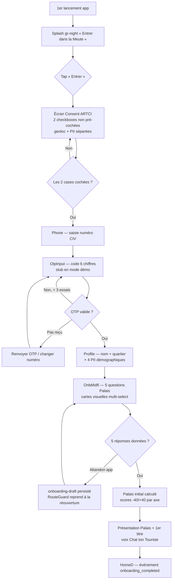
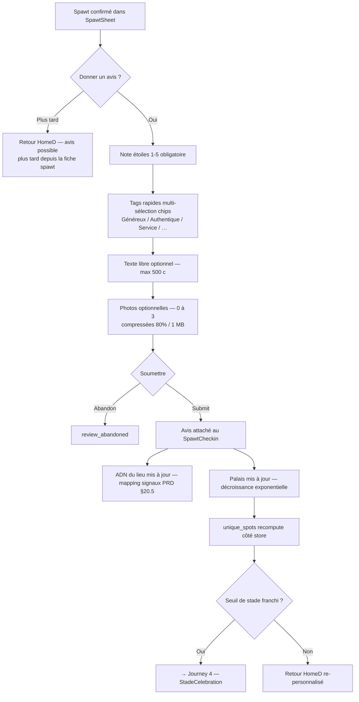
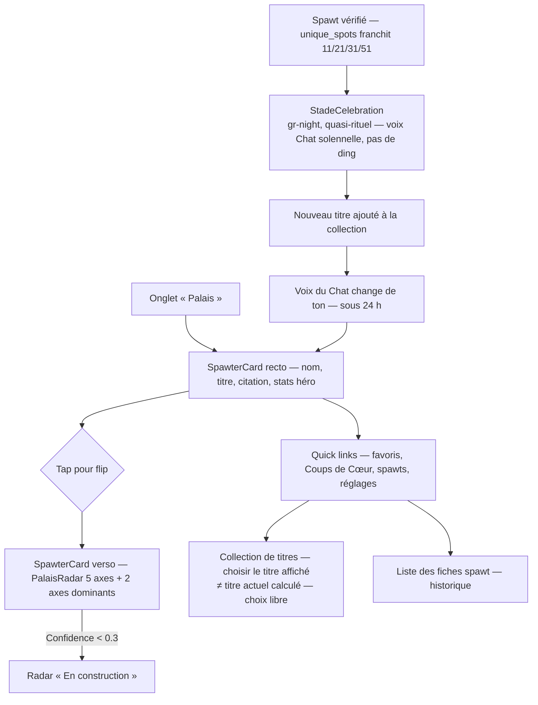

# UX Design Specification SPAWT mobile CI

**Author:** X-tin
**Date:** 2026-05-13
**Scope:** Sprint 1 V1 — 12 features priorisées (PRD + cahier §3.1)
**Target:** mobile (Expo SDK 55 · iOS 13+ / Android 10+), branche `spawt/v1-bmad`, canonical `app/`

<!-- UX design content will be appended sequentially through collaborative workflow steps -->

## ⚠️ Canonical Sources & Reconciliation

> **Mise à jour 2026-05-14 — découverte tardive du kit UX canonique.**
> Le kit `documentation/ux/` (ex-`SPAWT.zip`, brandbook v1.0 + `spawt-tokens.css`
> + wireframes + mid-fi + logos + polices) n'était pas dans le contexte initial
> du workflow. Les Steps 5/6/8/9 ont d'abord été construits sur
> `app/src/theme/tokens.ts` + PRD §15 — eux-mêmes désynchronisés du brandbook.
> Steps 8 et 9 ont été **réécrits** sur le kit canonique. Décision X-tin :
> **`documentation/ux/` est la source canonique UX/brand**, au-dessus du PRD §15
> et de `tokens.ts`.

### Hiérarchie des sources (canonique → dérivé)

1. **`documentation/ux/` — kit canonique UX/brand.** Tokens (`spawt-tokens.css`),
   typographie (Klinsman + Gotham), primitives (`Phone`, `CatBubble`,
   `MatchScore`, `PalaisRadar`, `TabBar`, chips, `btn-*`, `food-ph`), direction
   visuelle (magazine éditorial + mode contextuel), wireframes (Option D
   validée), mid-fi screens, brandbook v1.0.
2. **PRD V1 + cahier Sprint 1 + 4 personas** — source produit (scope, features,
   FR/NFR, Contrat à la Tribu).
3. **`app/src/theme/tokens.ts` + PRD §15** — **en drift**, à réaligner sur le kit
   (ticket dev — voir ci-dessous).

### Le kit canonique est une exploration — pas une spec figée

Le kit `documentation/ux/` est le **langage visuel et la pensée UX la plus
avancée** de SPAWT, mais c'est une **exploration** : il couvre le produit complet
(pas seulement Sprint 1), se contredit en interne (2 onboardings, 2 structures de
nav, 2 concepts de feed concurrents), et **dérive du PRD/Contrat** sur plusieurs
points. La spec UX **réconcilie** le kit avec le PRD + le Contrat — elle ne le
transcrit pas aveuglément.

### Décisions tranchées — drifts kit ↔ PRD ↔ Contrat

> **Statut : 11/11 tranchées par X-tin le 2026-05-14.** Certaines restent à
> confirmer en revue team (tech lead / Kidam) sur leurs implications techniques,
> mais la direction est figée.

| # | Drift constaté dans le kit `documentation/ux/` | ✅ Décision (X-tin, 2026-05-14) |
|---|---|---|
| D1 | Login/Signup en **email + mot de passe** (`midfi-screens-5`) | **PRD gagne — OTP only** (FR-001). Écrans `Login`/`Signup` du kit obsolètes, à refaire en OTP + Google Sign-In secondaire. |
| D2 | **« paws »** comme monnaie de progression | **Gardé, encadré** — « paws » conservé comme **compteur non-convertible** ; le **+50% paws Gold est supprimé** (pas d'accélération payante). ⚠️ *Garde-fou porteur : tout glissement vers du convertible/compétitif rouvre le conflit Contrat §20.1 — à re-challenger en revue Contrat dédiée.* |
| D3 | **« reconnaissances »** — compteur public | **Gardé, encadré** — « reconnaissances » conservé mais **non-public** (visible uniquement par le spawter concerné, jamais en classement ni en compteur social ouvert). ⚠️ *Même garde-fou que D2.* |
| D4 | **« Jalons »** — achievements multiples (`midfi-screens-5`) | **Sprint 1 = 1 seul badge `Premier Spawt`** (cahier §3.2). Les « Jalons » multiples = V1.5+. |
| D5 | **Tanière** = cercle privé d'amis ; favoris | **« Tanière » = cercle privé** (sens du kit). Les **favoris sont rencommés** (nouveau nom à fixer — proposition : « Mes spots » / « Ma liste »). ⚠️ *Le social de groupe (Crew / Meute fil / listes-vote) reste lourd pour Sprint 1 — scope à confirmer avec le tech lead ; le Mode Crew complet reste V2 (PRD §4.2).* |
| D6 | **« VTC »** dans la copy de la notif Le Guet (`midfi-screens-2`) | **PRD gagne — « Le Guet »**. Corriger la copy de la notif. |
| D7 | Note **4 étoiles** (`SpawtSheet`, `Stars max=4`) vs **5** | **PRD gagne — note 1-5**. Corriger le kit (`Stars max=4` → 5). Cohérent avec `app/src/types/spawt.ts` (`note_etoiles 1\|2\|3\|4\|5`) et la note pondérée PRD §7.2. |
| D8 | Axes Palais inventés dans `ProfilTerritoire` | **PRD gagne** — axes canoniques = Racines/Horizons · Tanière/Nomade · Exigeant/Enthousiaste · Foule/Secret · Maquis/Table. `ProfilTerritoire` = erreur kit ; `wireframe-kit` + `ProfilRadar` ont les bons. |
| D9 | **« Réserver · Premium »**, paiement **« Visa »** au paywall | **Hors scope V1** — réservation = V2 (PRD §4.2) ; paiement = Mobile Money agrégé CinetPay only. Retirer des écrans V1. |
| D10 | 2 onboardings concurrents dans le kit | **Onboarding = `OnbMidfi`** (cartes visuelles multi-select, 5 questions calibrage du Palais) — l'onboarding des « 6 écrans validés » de `SPAWT Mid-fi v3.html`. Le flow 5 écrans quartier/style/budget/mode (`Onb1-5`) = couverture étendue, écarté du Sprint 1. |
| D11 | Quel Home pour Sprint 1 ? | **Home = `HomeD`** — stories de modes compactes (44px) + carrousel de Unes éditoriales swipeable + édito du Chat + feuilleton. C'est le Home « grammaire validée » des 6 écrans validés de midfi v3. Le « Home contextuel » (drill-down par mode) reste en couverture étendue → V1.5. |

> **Ticket dev d'alignement (hors workflow UX)** : `app/src/theme/tokens.ts` doit
> être réaligné sur `documentation/ux/spawt-tokens.css` — couleurs (Or
> `#C8A44E`, Vert Chat `#2D6B4F`, Blanc cassé `#FAFAF8`) et polices (Klinsman +
> Gotham). PRD §15.1/§15.3 à amender. PRD/data-models à amender aussi pour D6
> (copy « Le Guet ») — D7/D8 confirment déjà le PRD.
>
> **À re-challenger en revue Contrat dédiée** : D2 (« paws ») et D3
> (« reconnaissances ») sont gardés *sous garde-fous* — leur conformité au
> Contrat à la Tribu §20.1 dépend strictement du respect de ces garde-fous
> (non-convertible, non-public). Session brand à programmer avant le code
> identité/profil.

## Executive Summary

### Project Vision

SPAWT est un compagnon de découverte culinaire **identitaire** pour Abidjan.
Promesse : « Ne plus jamais regretter un lieu. » Réduire le temps de décision de
~45 min (847 résultats Google Maps dans un rayon 5 km Cocody) à ~3 min, en filtrant
l'offre par un profil gustatif personnel — **le Palais** — calibré en continu sur
le comportement réel du spawter.

**Moat produit (non réplicable sans refonte de positionnement) :**

- **Le Guet** — mécanisme passif type VTC (geofence 10m · timer 15min · fenêtre
  +30min · snooze ×3) qui prouve la présence physique sans interrompre l'expérience
  culinaire. Brique data centrale (PRD §7.1, §3.1 Feature 5).
- **Le Palais** — 5 axes bipolaires [-1, 1] (Racines/Horizons, Tanière/Nomade,
  Exigeant/Enthousiaste, Foule/Secret, Maquis/Table), jamais figé, apprentissage
  exponentiel `learningFactor = max(0.05, 1/(1+n·0.05))` (PRD §5.1, §5.6).
- **L'ADN du Lieu** — 5 axes contrôlés par la communauté (Local/International,
  Informel/Établi, Budget/Premium, Populaire/Privé, Décontracté/Habillé), pas par
  le restaurateur (PRD §6.1).
- **Voix du Chat évolutive** — mascotte qui mûrit avec le spawter à travers 5
  tons distincts par stade (PRD §9.3).
- **Anti-leaderboard structurel** — Contrat à la Tribu §20.1 interdit le
  classement entre spawters. L'identité prime sur l'utilité (PRD §18.1 tension 8).

**Périmètre UX V1 (Sprint 1) :** 12 features priorisées sur 19 PRD (cahier §3.1)
— auth OTP, onboarding calibrage Palais, feed personnalisé, fiche lieu, Le Spawt,
avis structuré, profil, 5 stades, favoris, recherche/filtres, partage WhatsApp,
admin panel. Coup de Cœur, carte interactive, notifications push, paywall géo,
paiement et archétypes/mues sont reportés Sprint 2.

### Target Users

#### Personas produit (PRD §2.1) — qui utilise l'app

| Persona | Rôle stratégique UX | Note |
|---|---|---|
| **Betsy Diomandé** — Superfan event-go-er, 27-33, Assinie | **CORE — 70% des décisions produit**, premium driver | Cible UX dominante |
| **Dominic Koffi** — Jeune Fêtard, 18-24, Yopougon | Canal acquisition (TikTok), freemium only | Nouchi accepté, vibration locale |
| **Brice Konan** — Pro Établi, 32-39, Cocody | Premium qualité > quantité | Premium feeling exigé, partagerait-il sans honte ? |
| **Vanessa Kouakou** — Influenceuse, 25-31, Marcory | Levier marketing, **statut Ambassadrice séparé** | Canal acquisition, **pas une power user** |

#### Grille d'acceptation Test Tantie Rose (obligatoire chaque écran)

Validée comme contrainte UX globale — chaque écran Sprint 1 doit passer les 3
questions avant signoff Alexandre :

1. *Tantie Rose comprend-elle ?* (lisibilité, non-jargon, langue accessible)
2. *Brice Konan le partagerait-il sans honte à un client ?* (qualité, premium feeling)
3. *Dominic sent-il qu'il appartient ?* (modernité, vibration locale, nouchi accepté)

Si un seul **non** → retravail.

#### Personas reviewers (team) — qui valide chaque écran

Triple sign-off obligatoire avant merge (cahier §8) :

| Reviewer | Grille de validation | Outil de mesure |
|---|---|---|
| **Stéphanie** — Quality Lead | Crash-free >99% · 4 devices · 3G · OS-tue-app · WCAG AA · pas de fiche menteuse | Sentry · matrice devices · `lint:vocab` |
| **Kidam** — Product Performance Lead | Levier AARRR nommé · event analytics émis · hypothèse + seuil · cohorte mesurée | Mixpanel/PostHog · `events.md` (~80 events) |
| **Alexandre** — Strategy & Brand Lead | Vocab SPAWT · voix du Chat conforme stade · Contrat à la Tribu §20.1 · Test Tantie Rose | Audit verbal · `lint:vocab` · revue copy |

### Key Design Challenges

#### Zone de focus Sprint 1 — Le quadrilatère core (priorité dominante)

Décision X-tin : les 4 surfaces suivantes portent la confiance produit et le moat
identité>utilité. Elles doivent être designées **avant** les surfaces secondaires
(recherche, favoris, partage). Si une seule casse, SPAWT n'existe pas.

1. **L'action de spawter** — le geste central. Mode actif (confirmation après
   notif Le Guet), passif (présence prouvée sans réponse, poids 0.5x), manuel
   (mode démo + cas geoloc dégradée). Doit se compléter en **<30s** pour un spawt
   simple, **<2min** avec avis (FR-006, PRD §7.1).
2. **La géolocalisation** — consent ARTCI bloquant à l'onboarding (FR-040,
   Loi 2013-450), permissions Android `ACCESS_BACKGROUND_LOCATION` + iOS
   `NSLocationAlwaysAndWhenInUse` justifiées Le Guet, paywall géo 3km
   (gratuit) ↔ tout Abidjan (Gold) en Sprint 2, fallback batterie <10% en mode
   manuel.
3. **Les fiches utilisateurs (profil)** — radar Palais 2 axes gratuit / 5 axes
   Gold (FR-008), collection de titres permanente, titre actuel vs titre affiché
   (choix de l'utilisateur), stade actuel, voix du Chat conforme au stade.
   Surface d'identité = moat de rétention.
4. **Les fiches spawt (fiche lieu)** — photo, nom, quartier, cuisine, prix,
   note pondérée par stade (1x→3x), horaires, CTA Appeler + WhatsApp, score
   matching [50%, 99%], radar ADN si ≥5 avis sinon « ADN en construction »
   (FR-005), signaux spéciaux (Pépite Vérifiée, Institution, Coup de Cœur,
   Fidélité, Découverte, Table Diverse, Noctambule Vérifié — PRD §6.3).

#### Tensions UX transversales à résoudre

5. **Le Guet — visible/discret.** Rassurer le spawter que le mécanisme tourne
   sans interrompre le repas. En mode démo le Guet n'est pas armé → CTA manuel
   « Je spawt ici » remplace l'automatique. À designer sans casser la démo.
6. **Cold start massif.** Au J0 50-100 lieux × 3 avis fondateurs `is_seed`
   (alimente ADN, exclu du compteur public, FR-032 amendé) → 100% des fiches
   afficheront « ADN en construction » tant que `total_reviews_public < 5`.
   Anti-mensonge user (Stéphanie) + anti-fiche fantôme (Alexandre).
7. **Stade célébré sans gamifier.** PRD impose un « écran de célébration »
   à chaque passage Touriste→…→Guide (FR-010), mais Duolingo est rejeté
   (confettis, ding, badge XP). Ton recherché : **moment quasi-rituel** que la
   voix du Chat porte (`enjoue_taquin` → `complice` → `grave_respectueux` →
   `solennel` → `rare_sacre`).
8. **Coup de Cœur — rareté matérialisée** (Sprint 2, mais à penser dès Sprint 1).
   Quota mensuel 1/1/1/2/3 selon stade. Geste cérémoniel (long-press ?
   confirmation sheet ? voix du Chat solennelle ?) sans devenir un compteur de
   likes déguisé.
9. **Onboarding 4 étapes → 70% completion (cible PRD §16.1, SC-ACT-01).** Funnel :
   Splash → Consent ARTCI bloquant (FR-040) → Phone+OTP → Profile (nom +
   quartier + 4 PII) → 5 questions calibrage Palais. Chaque % perdu sur le
   funnel = -1.4% rétention M1. Friction perçue concentrée sur consent + PII.
10. **Triple device matrix.** Tecno Spark (Android low-end, 5") ↔ Infinix Hot ↔
    Samsung A ↔ iPhone récent + iPhone -2 ans. Perf P95<3s en 3G + APK<50MB +
    OS-tue-app sur Tecno/Infinix. Design tokens + layout discipline non
    négociables, pas un détail.

### Design Opportunities

1. **Faire du profil un objet de fierté quotidien.** Identité>utilité (PRD §18.1
   tension 8). Le radar Palais + la collection de titres permanente + le titre
   choisi parmi la collection (FR-008) ouvrent une UX d'auto-affirmation forte,
   pas un onglet caché.
2. **Voix du Chat = signature produit.** Passage progressif `enjoue_taquin` →
   `rare_sacre` sur 5 stades crée une intimité ritualisée. Levier brand
   massif et non réplicable.
3. **« En construction » comme acte de respect.** Au lieu de cacher la faible
   confidence, l'afficher comme un signe d'honnêteté SPAWT — *anti-mensonge user*
   devient un trait de marque. Peut décliner sur tous les états vides.
4. **Mode démo intégré comme affordance.** Bandeau `DataSourceBanner` toujours
   monté en fallback. Plutôt qu'un avertissement gris, un signal de transparence
   avec voix du Chat — transforme la limitation en signature.
5. **Score [50%, 99%] et non [0%, 100%].** Le score affiché ne descend jamais
   sous 50 — pas de « lieu rejeté » (FR-004, PRD §8.3). Plié dans l'UX comme
   une promesse SPAWT (« on ne te dira jamais qu'un lieu est nul »).

## Core User Experience

> **⚠️ Patch 2026-05-14 — réconciliation kit canonique.** Cette section
> (action centrale, core loop, principes, moments-clés) **reste valide** sur le
> fond. Précisions issues du kit `documentation/ux/` : la **navigation** est
> à **5 onglets** — Feed · Carte · [FAB + Spawter] · Meute · Palais (pas le
> 3-tab esquissé ici) ; le FAB central porte l'action Spawter. Le Home Sprint 1
> est **`HomeD`** (stories de modes + carrousel de Unes — décision D11
> tranchée) ; le « mode contextuel » drill-down est reporté V1.5.

### Defining Experience

#### Core User Action — Spawter

L'action centrale du produit est **Spawter** : confirmer une visite via Le Guet.
C'est la brique data centrale (PRD §7.1) et le point d'activation produit
(Kidam : « Activation = 1er Spawt »). Cible : <30s pour un spawt simple,
<2min avec avis structuré (FR-006, FR-007).

**Distinction action centrale produit vs fréquence :**

- *Action centrale produit* : **Spawter** — définit la valeur, alimente le
  Palais et l'ADN, justifie le moat.
- *Action centrale fréquence* : **Consulter le feed personnalisé** — 3,5
  sessions/sem × 7 min cible PRD §16.1. C'est le véhicule quotidien.

L'UX doit servir les deux, mais privilégier que **chaque session se termine
par un spawt** quand le contexte physique le permet.

#### Core Loop

```
Découverte (feed/recherche) → Fiche lieu → Se rendre au lieu →
Le Guet déclenche (geofence 10m + 15min) → Notif "Comment c'était ?" →
Confirmer spawt (1 tap) → (optionnel) Avis structuré →
Palais s'apprend (exponentielle) → Feed se re-personnalise → ...
```

### Platform Strategy

| Dimension | Décision | Référence |
|---|---|---|
| Plateforme | Mobile native iOS + Android | PTR-PLAT-01 |
| Versions OS | iOS 13+ / Android 10+ | project-context |
| Stack | Expo SDK 55 · RN 0.83 · TS strict · Zustand · Supabase (optionnel) | docs/architecture-mobile-app.md |
| Input | Touch-first | PTR-CAP-03 |
| Réseau | Offline-tolerant — spawts queue localement, sync au retour réseau | FR-039, NFR-AVAIL-02 |
| Géoloc | Background geofencing natif basse consommation | PTR-CAP-01 |
| Notifications | Push serveur + locales (Le Guet) | PTR-CAP-02 |
| Caméra | Avis photos (3 max, 1 MB, qualité 80%) | PTR-CAP-03 |
| Deep linking | Entrant + sortant (partage WhatsApp, renouvellement Gold) | PTR-CAP-04 |
| Web | **Pas de web user-facing V1.** Le panel admin `spawt_staff` (Refine, codebase séparée) est **Sprint 1** (FR-023 / Epic 6) — non user-facing, donc hors périmètre de cette spec UX mobile et sans contrainte brand canonique. | PTR-PLAT-02/03 |
| Multi-villes | `country_code` dans `spawters`, `places`, `plans`, `currencies` | NFR-PORT-01 |

**3 chemins de livraison Sprint 1 :**

1. **Expo Go (démo)** — `npx expo start --tunnel`, scan QR. Limitation : pas
   de geoloc background = pas de Le Guet automatique. CTA manuel « Je spawt
   ici » remplace.
2. **EAS APK Android (alpha canonical)** — `npx eas-cli build --profile preview --platform android`.
   Matrice 4 devices imposée (Tecno Spark · Infinix Hot · Samsung A · iPhone).
   Geoloc background OK. **Chemin de livraison principal Sprint 1.**
3. **iOS .ipa** — chemin secondaire, déclenché manuellement quand iOS doit
   être inclus dans une session alpha. Apple Developer 99$/an requis.

**Mode démo intégré comme affordance :** Le `DataSourceBanner` reste monté en
permanence quand `dataSourceMode === "fallback"`. C'est un signal de
transparence, pas un avertissement honteux.

### Effortless Interactions

| Interaction | Effort utilisateur | Promesse mesurée |
|---|---|---|
| **Le Guet automatique** | Zéro — le Chat fait le guet pendant le repas | Différenciateur vs Foursquare déclaratif |
| **Décision feed à l'ouverture** | Zéro filtre à appliquer — 10 lieux scorés [50%, 99%] | Time-to-first-feed P95 < 3s sur 3G (NFR-PERF-01) |
| **Confirmer le spawt après notif** | 1 tap | <30s spawt simple, <2min avec avis (FR-006) |
| **Sauvegarder en favori (Tanière)** | 1 tap depuis la fiche | <500ms (FR-009) |
| **Partager WhatsApp** | 1 tap → deep link auto-formaté image + nom + note | <5s (FR-016) |
| **Reprendre après interruption** | Zéro re-login — `RouteGuard` hydrate le store | `(onboarding)` ou `(tabs)` selon présence spawter |
| **Démarrer en mode démo** | `npx expo start --tunnel` + scan QR | <5 min, pas de backend requis |

### Critical Success Moments

Hiérarchisés par impact sur la trajectoire produit :

1. **🥇 La 1ère notif Le Guet reçue à la fin d'un repas.** Le moment magique
   qui démontre que SPAWT fait quelque chose que personne d'autre ne fait. *Si
   ce moment rate (notif pas envoyée, geofence rate, OS-tue-app sur Tecno),
   SPAWT meurt sur le terrain.* Enjeu #1 de l'alpha 5 spawters Sprint 1
   (cahier §5.8).
2. **1er spawt complété — Activation J+7** — cible 60% (SC-ACT-03). Le moment
   où le user **vit** SPAWT pour la première fois. Sans lui, le Palais ne
   démarre pas.
3. **Splash → Onboarding completed** — cible 70% (SC-ACT-01). Verrou consent
   ARTCI bloquant + PII + 5Q calibrage Palais.
4. **1ère consultation du Palais avec confidence ≥0.3** — moment où
   l'identité émerge. Avant ce seuil : « En construction ».
5. **1ère montée de stade (Touriste → Explorateur, 11 spots uniques)** —
   moment quasi-rituel, marque l'appartenance. Doit être célébré sans
   gamifier (défi UX #7).
6. **1er partage WhatsApp accepté par un proche** — coefficient viral cible
   1.4 (SC-REF-02). Levier #1 d'acquisition organique.
7. **1ère séance avec ADN ≥5 avis sur un lieu** — fin du cold start massif
   pour ce lieu. Le radar ADN passe d'« En construction » au radar plein.
8. **1ère facture Gold reçue** (Sprint 2) — moment Brice Konan « j'ai
   investi dans cette marque ».

### Experience Principles

Les 4 principes non négociables qui guident toutes les décisions UX V1 :

1. **Identité avant utilité.** Le profil (Palais + collection titres + stade)
   est central, pas un onglet caché. Chaque écran renforce qui le spawter EST
   autant que ce qu'il PEUT. *PRD §18.1 tension 8, Alexandre.*
2. **Le Chat parle, ou le Chat ne parle pas.** Aucune copy générique
   (« Welcome », « Find a place », « Thanks »). Toutes les voix UI passent
   par `chat-voice.ts` mapping (stade × moment) → clé i18n. *PRD §9.3, voix
   `enjoue_taquin → complice → grave_respectueux → solennel → rare_sacre`.*
3. **Honnêteté plutôt que masque.** « En construction » s'affiche quand
   `confidence < 0.3` plutôt qu'un radar non-fiable. L'anti-mensonge user
   devient un trait de marque. *Stéphanie, `AxisRadar.underConstruction`.*
4. **Local-first respire le réseau.** Toute action user écrit immédiatement
   dans le store Zustand + AsyncStorage. Sync Supabase = fire-and-forget.
   L'utilisateur n'attend jamais le réseau pour voir son geste pris en
   compte. *spawter-store.ts, project-context.*

**Invariant transversal (non négociable) :** L'anti-leaderboard est sacré.
Pas de classement, pas de like, pas de compteur compétitif. Le stade, les
Coups de Cœur, les titres sont des mécaniques d'**identité**, pas de score.
*Contrat à la Tribu PRD §20.1, audit `lint-vocab` bloquant.*

## Desired Emotional Response

### Primary Emotional Goals

**Émotion transversale dominante** : **APPARTENANCE** — « Je fais partie de la
Meute SPAWT. » C'est exactement ce que protège le Contrat à la Tribu (PRD §20.1)
et ce que la voix du Chat évolutive porte par sa progression `enjoue_taquin`
→ `complice` → `grave_respectueux` → `solennel` → `rare_sacre`.

**Déclinaison par persona** :

| Persona | Phrase-cible attendue |
|---|---|
| **Betsy Diomandé** (CORE) | *« Je suis vue. SPAWT me connaît. »* |
| **Brice Konan** (Pro Établi) | *« C'est sophistiqué. C'est pour moi. Je peux le partager sans honte. »* |
| **Dominic Koffi** (Jeune Fêtard) | *« Ça vibre, c'est mon truc. »* |
| **Tantie Rose** (test acceptation) | *« Ça parle ma langue, ça ne me prend pas pour une bêtise. »* |

**Secondary Feelings** (4 émotions de support) :

1. **Confiance** — SPAWT ne ment pas, ne piège pas
2. **Reconnaissance identitaire** — mon Palais, mon stade, mes titres
3. **Sérénité curieuse** — pas de FOMO, pas de stress compétitif
4. **Mini-magie discrète** — Le Guet devine, le Palais apprend, le Chat mûrit

**Émotions à éviter explicitement** (drift signals émotionnels) :

- Compétition / FOMO (interdit par le Contrat §20.1)
- Honte (« tu es Touriste rang #485 du jour » → jamais)
- Frustration (lenteur, mensonge produit, fiche fantôme)
- Confusion (Tantie Rose galère → écran à retravailler)
- Anxiété (« vais-je perdre mon stade ? » → invariant "ne recule jamais")
- Solitude (user anonyme isolé → toujours « la Meute »)

### Emotional Journey Mapping

| Étape clé | Émotion cible | Émotion à éviter |
|---|---|---|
| Découverte (App Store / TikTok) | Intrigue + curiosité (« qu'est-ce que c'est SPAWT ? ») | Banalité (« encore un Yelp ») |
| Splash → « Entrer dans la Meute » | Appel à appartenance | Pression commerciale |
| Consent ARTCI bloquant | Confiance dans la transparence (le Chat explique) | Méfiance d'être espionné |
| OTP + profil + 4 PII | Souveraineté (« je donne ce que je veux ») | Intrusion (« pourquoi mon âge ? ») |
| 5 questions calibrage Palais | Plaisir de l'introspection | Test académique, jugement |
| Présentation du Palais initial | Reconnaissance (« c'est moi ça ! ») | Cliché (« comme tout le monde ») |
| Découverte du feed | Curiosité (« qu'est-ce que SPAWT me propose ? ») | Déception (« même que Google ») |
| Ouverture fiche lieu | Confiance qualitative | Méfiance (avis bidons ?) |
| Aller au lieu | (SPAWT s'efface — c'est le moment du repas) | — |
| 🥇 **Notif Le Guet à la fin du repas** | **Mini-magie** (« il a su que j'avais fini ») | Intrusion, sentiment d'être pisté |
| Confirmer le spawt (1 tap) | Satisfaction du geste (« mon goût compte ») | Corvée |
| Donner un avis | Soin (« j'écris pour les autres spawters ») | Spam, rating fast-food |
| Voir le Palais évoluer | Fierté identitaire (« je deviens quelqu'un ») | Indifférence |
| Montée de stade Touriste→Explorateur | **Moment quasi-rituel** (« je grandis dans la Meute ») | Gamif Duolingo, ding sonore |
| Partage WhatsApp d'un lieu | Fierté de transmettre | Pub déguisée, honte |
| Re-ouverture app J+7 | Familiarité chaleureuse (« le Chat me reconnaît ») | Étrangeté |
| Erreur (réseau down, fiche manquante) | Compassion technique (le Chat s'excuse) | Mépris (« réessayez plus tard ») |

### Micro-Emotions

Les 5 micro-émotions critiques pour le succès produit :

| Micro-émotion désirée | Plutôt que | Pourquoi |
|---|---|---|
| **Confiance** | Méfiance | SPAWT gagne la confiance, ne la simule pas (anti-mensonge Stéphanie) |
| **Appartenance** | Isolement | La Meute fait grandir la Meute (Alexandre, Contrat §20.1) |
| **Reconnaissance** | Anonymat | Identité avant utilité (PRD §18.1 tension 8) |
| **Sérénité curieuse** | FOMO / anxiété | Pas de compétition (Contrat à la Tribu) |
| **Mini-magie discrète** | Indifférence | Différenciateur vs Google Maps fonctionnel |

### Design Implications

Comment l'UX *produit* chaque émotion concrètement :

| Émotion désirée | Levier UX concret |
|---|---|
| **Confiance** | `DataSourceBanner` monté en permanence en démo · `AxisRadar.underConstruction` quand `confidence<0.3` · consent ARTCI granulaire (geoloc séparé de PII, 2 checkboxes distinctes FR-040) · seed avis `is_seed` distingués dans admin |
| **Appartenance** | `chat-voice.ts` mapping (stade × moment) strict · audit `lint:vocab` bloquant les mots interdits · adresses descriptives style « rue X, derrière Y, après le maquis Z » · ton du Chat qui mûrit avec le spawter |
| **Reconnaissance** | Profil central avec radar Palais affiché immédiatement (pas un onglet caché) · titre actuel vs titre affiché choisi librement (FR-008) · collection de titres permanente · stade visible mais non gamifié |
| **Sérénité curieuse** | Aucun compteur compétitif visible · Coup de Cœur sans « X reçus aujourd'hui » · stade ne recule jamais (invariant SQL §5.2) · notifs plafonnées 3-4/sem hors Le Guet (FR-019) |
| **Mini-magie discrète** | Le Guet automatique passif (zéro action user pendant le repas) · notif juste après le repas (timer 15min + fenêtre +30min) · célébration stade quasi-rituelle sans ding sonore artificiel |

### Emotional Design Principles

5 principes émotionnels qui guident toutes les décisions UX :

1. **L'appartenance avant l'usage.** Toute UX renforce le sentiment d'être dans
   une Meute identifiable, jamais d'être un *user* anonyme dans une foule. Le
   Chat parle au spawter, jamais à un user générique.
2. **La rareté plutôt que l'inflation.** Coups de Cœur, montées de stade, mues
   d'archétype, Pépite Vérifiée — les signaux forts sont rares, donc précieux.
   Pas de notif spam, pas de récompense quotidienne, pas de "streak à maintenir".
3. **L'honnêteté plutôt que la promesse vide.** « En construction » s'affiche
   quand SPAWT ne sait pas encore. La confiance est gagnée, pas simulée. C'est
   une posture émotionnelle, pas qu'une règle UX.
4. **La sérénité plutôt que l'anxiété.** Le stade ne recule jamais. Pas de
   classement. Pas de compteur public. Pas de FOMO. SPAWT est un compagnon,
   pas un coach qui vous gronde.
5. **La mini-magie plutôt que le spectacle.** Le Guet qui devine, le Palais qui
   apprend, le Chat qui mûrit — les moments forts sont discrets et bien
   chronométrés, pas des animations bruyantes. Anti-Duolingo.

## UX Pattern Analysis & Inspiration

> **⚠️ Patch 2026-05-14 — réconciliation kit canonique.** La **référence
> d'inspiration n°1 de SPAWT, c'est le kit `documentation/ux/` lui-même** :
> il porte la direction « magazine éditorial + mode contextuel », le
> traitement de la voix du Chat, la carte spawter flip, la célébration de
> stade `gr-night`. Les produits externes ci-dessous restent des références
> *secondaires* — utiles pour des patterns ponctuels — mais le kit canonique
> prime sur eux en cas de tension. The Fork reste pertinent (fiche lieu
> photo-rich, filtres) ; les anti-modèles (Glovo, Foursquare, Duolingo, etc.)
> restent valides.

### Inspiring Products Analysis

8 produits étudiés comme références positives pour SPAWT V1 :

| # | App | Ce qu'on en extrait |
|---|---|---|
| **1** | **Spotify** (Wrapped + DJ Daily Mix) | Personnalisation rituelle · voix de marque chaleureuse · anti-leaderboard structurel · signature par le ton |
| **2** | **Strava** (Athlete profile + heatmap) | Identité forte comme vitrine quotidienne · radar perf ≈ radar Palais · collection de records permanente · kudos qui célèbrent sans humilier |
| **3** | **Headspace** | Voix de marque ultra-cohérente sur 1000+ écrans · ton apaisant · anti-FOMO · célébrations rituelles sans confettis · pas de streak anxiogène |
| **4** | **Wave** (Mobile Money CIV) | UX Mobile Money premier-classe · simplicité disarming pour user low-tech · FCFA natif · onboarding court · paiement 2 taps |
| **5** | **Pokémon Go** (référence Le Guet uniquement) | Géofence comme magie discrète physique-digitale · mécanisme passif chronométré qui crée des moments de surprise |
| **6** | **Yango Maps** (CIV) | Navigation native CIV · adresses descriptives ouest-africaines first-class · multi-service mature pour utilisateur low-bandwidth · connaissance terrain locale |
| **7** | **Boomplay** | Découverte culturelle africaine · identité musicale forte · personnalisation par préférences culturelles · freemium intelligent avec offline tolérance |
| **8** | **The Fork** (LaFourchette) | **Fiche lieu restauration premium** : photos riches en hero · filtres efficaces (cuisine, prix, ambiance, distance) · réservation 1-tap (modèle pour V2) · reviews structurées avec photos. ⚠ Adapter : note plate à remplacer par note pondérée par stade (FR-037) · Yums (programme points compétitif) à **rejeter** — anti-Contrat |

### Transferable UX Patterns

#### À ADOPTER tel quel

- **Spotify Wrapped → Cérémonie montée de stade.** Modèle de moment rituel
  personnalisé qui célèbre sans gamifier. Réutilisable pour FR-010
  (Touriste→Explorateur, etc.).
- **Spotify DJ « Your DJ » → Voix du Chat évolutive.** Le ton qui s'adresse
  au user comme un familier — modèle d'écriture pour `chat-voice.ts` × 5 stades.
- **Strava Athlete profile → Profil SPAWT central.** Le profil n'est pas un
  onglet caché — c'est la vitrine quotidienne. Modèle pour `(tabs)/profile`
  avec radar Palais immédiatement visible.
- **Headspace voix consistante → Vocab SPAWT bloquant.** Une voix produit
  unique sur 100% des écrans, gardée cohérente par audit (`lint:vocab`).
- **Pokémon Go geofence quiet trigger → Notif Le Guet.** Notif locale
  chronométrée qui apparaît au bon moment, sans demander de permission
  constante.
- **Yango Maps adresses descriptives → Fiche lieu SPAWT.** Modèle d'adresse
  style ouest-africain (« rue X, derrière Y, après le maquis Z ») cohérent
  PRD §14.2. Pas de coordonnées GPS brutes affichées.
- **Boomplay offline mode → Mode démo SPAWT + queue spawts.** Modèle de
  « ça marche même sans réseau » sans afficher de message d'erreur agressif
  (cf. FR-039 + `DataSourceBanner` toujours monté).
- **The Fork hero photo + filtres → Fiche lieu SPAWT.** Modèle de hero
  photo généreuse (cf. FR-005 cover_photo_url) · filtres concis (cuisine,
  budget, distance, note — FR-013) · galleries swipeables.

#### À ADAPTER (modifier)

- **Strava social → kudos sans compétition.** Garder la célébration entre
  pairs, retirer segments/leaderboards. Pour V1.5 partage WhatsApp + Coup
  de Cœur.
- **Spotify Wrapped annual → par stade.** Pas annuel mais à chaque passage
  11/21/31/51 spots = mini-Wrapped (voix solennelle, recap des spots qui
  ont compté).
- **Wave Mobile Money flow** → Garder la sobriété, adapter pour le paywall
  géo Gold (Sprint 2) — pas la pub agressive Stripe.
- **Headspace courses** → adapter pour onboarding 5 questions calibrage
  Palais comme mini-méditation guidée, pas un quizz académique.
- **Boomplay personnalisation culturelle → Feed SPAWT.** Adapter le modèle
  de découverte par identité (genre musical ≈ Palais 5 axes) au score
  composite FR-004.
- **The Fork réservation 1-tap → Reporté V2.** Pattern de booking sans
  friction utile à mémoriser, mais hors scope Sprint 1/V1. À déclencher
  uniquement quand l'écosystème CIV (paiement, no-show policy, gestion
  resto) sera prêt.
- **The Fork note 1-10 → Note pondérée par stade.** Remplacer la note plate
  par la note pondérée 1x→3x selon le stade du votant (FR-037, PRD §7.2).
  Le pattern d'affichage hero (gros chiffre + étoiles) reste valide.

### Anti-Patterns to Avoid

6 anti-modèles explicitement rejetés :

| App | Pourquoi anti-modèle SPAWT |
|---|---|
| **Foursquare / Swarm** | Check-in déclaratif (vs Le Guet passif) · mayorships · points compétitifs · leaderboard — exactement ce que le Contrat à la Tribu §20.1 interdit |
| **Yelp / TripAdvisor** | Reviews génériques anonymes · listings denses · note plate sans pondération · aucune identité spawter · fiches fantômes massives |
| **Duolingo** | Gamification compétitive bruyante · streaks anxiogènes · ding sonore · mascotte qui gronde — **rejeté explicitement par Alexandre** |
| **Google Maps** | 847 résultats indifférenciés en rayon 5km Cocody · recherche universelle · aucune identité user · précisément le pain point que SPAWT résout (PRD §1.5) |
| **TikTok / Instagram** | **Vanity metrics & validation publique** : likes/followers/views visibles · story view counter · infinite scroll algorithmique · pression de performance sociale — contre Contrat §20.1 « pas de classement entre spawters » |
| **Glovo** *(et delivery en général : Uber Eats, Yango Deli, Jumia Food)* | **Modèle livraison** : le courier amène le repas au user · pas de présence physique · pas de Le Guet possible · le Palais n'apprend plus du réel · l'ADN se construit hors-sol · le Coup de Cœur perd son sens (« j'y suis allé ») — **toute option de livraison serait un drift produit, pas une feature** |

Patterns dérivés à éviter :

- **Compteurs publics de validation** (likes, followers, views, "seen by") →
  contre le Coup de Cœur monnaie rare et l'anti-leaderboard
- **Infinite scroll algorithmique** sans frein → FOMO entretenu
- **Story view counter** = micro-leaderboard d'engagement social
- **Reels/TikTok-style metrics** ("X mille vues sur ma vidéo culinaire") →
  contraire à la rareté du Coup de Cœur
- **Streaks à maintenir** (style Duolingo) → anxiété de perdre = anti-Contrat
- **Listings denses indifférenciés** (style Yelp) → 847 résultats sans
  hiérarchie = pas de moat
- **Notifs récurrentes promotionnelles** → notifs SPAWT plafonnées à 3-4/sem
  hors Le Guet (FR-019)
- **« Commander à domicile »** comme CTA primaire ou secondaire sur la fiche
  lieu → SPAWT = aller au lieu. Le seul CTA de visite c'est « Y aller »
  (carte/navigation), pas « Se faire livrer »
- **Listing « disponible à la livraison »** comme filtre/badge → drift produit
- **Notion de panier / cart / order tracking** → hors scope SPAWT par
  construction (jamais en V1, V1.5 ou V2)
- **The Fork Yums (programme de points compétitif)** → toute monnaie
  d'engagement transformable en avantage commercial est interdite par le
  Contrat à la Tribu §20.1. Le Coup de Cœur reste une monnaie sociale rare,
  pas un point convertible.

### Design Inspiration Strategy

| Catégorie | Stratégie SPAWT |
|---|---|
| **Identité utilisateur** | Strava-like (profile vitrine) + Spotify Wrapped (rituel) — **PAS** Foursquare badges, **PAS** Instagram/TikTok counters |
| **Voix produit** | Spotify DJ + Headspace + Mailchimp Freddie style — **PAS** Duolingo nag, **PAS** Clippy interruption |
| **Magie discrète** | Pokémon Go geofence trigger — **PAS** Foursquare nag check-in |
| **Sobriété visuelle** | Wave + Headspace + Apple Health — **PAS** Yelp listing density, **PAS** Google Maps clutter, **PAS** TikTok infinite scroll |
| **Onboarding** | Headspace gentle intro + Co-Star questionnaire identitaire — **PAS** quizz académique |
| **Mobile Money** | Wave 2-taps + Yango (CIV native) — **PAS** Stripe-like avec fees en fine print (Sprint 2) |
| **Cold start** | Strava « no activities yet » empty state honest tone + Boomplay offline — **PAS** Yelp fake « New restaurant! » |
| **Adresses & navigation locale** | Yango Maps adresses descriptives ouest-africaines — **PAS** coordonnées GPS brutes |
| **Découverte culturelle** | Boomplay personnalisation par identité culturelle — **PAS** TikTok algorithme opaque infini |
| **Mode de consommation** | Aller au lieu, vivre l'expérience sur place — **PAS** livraison à domicile (Glovo / Uber Eats / Yango Deli / Jumia Food = anti-modèles structurels, pas Sprint X) |
| **Fiche lieu (photos + filtres)** | The Fork hero photo + filtres concis (cuisine/budget/distance/note) — **PAS** liste plate Yelp |
| **Réservation 1-tap** | The Fork pattern (mémorisé pour V2) — **PAS** flow multi-étapes Stripe-like |

## Design System Foundation

> **⚠️ Patch 2026-05-14 — réconciliation kit canonique.** L'approche
> (RN primitives + tokens + composants custom, pas de framework UI tiers)
> **reste valide**. Mais les *contenus* sont à réaligner sur le kit
> `documentation/ux/` : tokens (`spawt-tokens.css` — Or `#C8A44E`, Vert Chat
> `#2D6B4F`, Blanc cassé `#FAFAF8`), polices (**Klinsman + Gotham**), et
> surtout le **kit de primitives canonique** `midfi-kit.jsx` qui définit les
> vrais composants SPAWT. Le détail palette/typo est dans la section *Visual
> Design Foundation* (réécrite). Voir aussi *Canonical Sources & Reconciliation*.

### Design System Choice

**Approche retenue : Hybride sobre — RN Primitives + Tokens canoniques + Kit de composants `midfi-kit`.**

L'ossature (RN primitives, theming, pas de framework UI tiers) est déjà en
place dans `app/`. Ce qui change après la découverte du kit canonique : les
**tokens** et le **kit de composants** sont ceux de `documentation/ux/`, pas
ceux de `tokens.ts` (en drift) ni les 4 composants RN actuels (sur anciens
tokens).

**Architecture en couches :**

1. **Foundation** — React Native primitives natifs (`View`, `Text`,
   `Pressable`, `ScrollView`, `FlatList`, `Image`). Pas de framework UI tiers.
2. **Theme tokens** — source canonique `documentation/ux/spawt-tokens.css`.
   `app/src/theme/tokens.ts` à réaligner (ticket dev prérequis) : Noir
   `#0A0A0A`, Or `#C8A44E`, Vert Chat `#2D6B4F`, Blanc cassé `#FAFAF8`,
   gradients `gr-night` / `gr-gold`. Accès via `useTheme()`.
3. **Typography** — **Klinsman** (display — titres, noms, voix du Chat) +
   **Gotham** (body — corps, data, overlines). Polices dans
   `documentation/ux/fonts/`.
4. **Kit de composants canonique** — `documentation/ux/midfi-kit.jsx` est la
   référence : `CatBubble`, `PlaceCard`/carte éditoriale, `PalaisRadar`,
   `MatchScore`, `Stars`, `SpawtPin`, `Wordmark`, `Ico` (set complet),
   `TabBar` (5 onglets), chips (`chip-gold/green/dark/outline`), `btn-*`,
   `food-ph`. Les 4 composants RN actuels (`ChatBubble`, `PlaceCard`,
   `AxisRadar`, `DataSourceBanner`) sont à **re-dériver** sur ces primitives +
   les tokens canoniques. Composants Sprint 1 à venir : `OtpInput`,
   `SearchBar`+`FilterChips` (`SearchFilters` du kit), `ReviewForm` (= sheet
   de notation), `GuetIndicator`, `ShareSheet` (= `SpawtePartage`),
   `StadeCelebration` (`gr-night`), états vides.
5. **Voix UI** — `chat-voice.ts` map (stade × moment) → clé i18n FR.json.
   Aucune string littérale dans les composants.
6. **Audit gardien (triple gate avant commit)** — `tsc --noEmit` +
   `lint:vocab` + `i18n:check` bloquent les drifts.

### Rationale for Selection

**Pourquoi pas un framework UI tiers (Tamagui, NativeBase, React Native Paper) ?**

| Critère | Verdict |
|---|---|
| **Performance** | RN primitives + Hermes + `StyleSheet.create` = bundle minimal (NFR-PERF-06 cible <500 KB gzip). Un framework UI tiers ajoute 100-300 KB → infaisable sur APK <50 MB. |
| **OS-tue-app Tecno/Infinix** | Moins de couches = moins de risques d'incompatibilité sur low-end Android (NFR-AVAIL-03). |
| **Brand control** | Alexandre exige une voix produit unique sur 100% des écrans. Material/Ant defaults = drift garanti. |
| **Audit auto** | `lint:vocab` ne peut pas auditer facilement les composants d'un framework tiers. |
| **Existing code** | `app/` est déjà construit sur cette approche. Changer maintenant = refonte stérile. |

**Pourquoi pas un Custom Design System full from scratch ?**

- Effort Sprint 1 trop élevé (Stéphanie bloque, cf. matrice 4 devices + alpha 5 spawters)
- L'approche hybride **est déjà** custom là où ça compte (Palais, ADN, Voix du
  Chat, mode démo) — pas besoin de tout réinventer

### Implementation Approach

**État actuel (Phase 0 quasi terminée, cf. CHANGELOG v1.1.2) :**

- ✅ `tokens.ts` source unique en place · `ThemeProvider` actif
- ✅ 4 composants custom déjà codés et utilisés
- ✅ `chat-voice.ts` mapping en place · `fr.json` source unique
- ✅ Audits `lint:vocab` + `i18n:check` bloquants
- ⏳ 6 composants Sprint 1 à venir (Phase 1.1 → 1.4)

**Roadmap composants Sprint 1 (alignée `docs/component-inventory-mobile-app.md`) :**

| Composant | Pour | Phase |
|---|---|---|
| `OtpInput` | Feature 1 (auth OTP) | 1.1 |
| `SearchBar` + `FilterChips` | Feature 10 (recherche/filtres) | 1.2 |
| `ReviewForm` (note + tags + texte 500c + 3 photos) | Feature 6 (avis structuré) | 1.3 |
| `GuetIndicator` (pulse « Le Chat fait le guet… ») | Feature 5 (geofence actif) | 1.3 |
| `ShareSheet` (deep link WhatsApp) | Feature 16 (partage) | 1.4 |
| `StadeCelebrationScreen` (passage Touriste→Explorateur) | Feature 8 (stades) | 1.4 |

Chaque nouveau composant doit :

1. Utiliser uniquement les tokens via `useTheme()`
2. Exposer la copy via `t("scope.key")` i18n
3. Préfixe `Spawt` interdit (réservé au métier — cf. project-context §3)
4. Passer la triple gate avant merge

### Customization Strategy

| Layer | Stratégie |
|---|---|
| **Tokens** | Source unique `tokens.ts`. Toute nouvelle nuance passe par revue **Alexandre** (brand) + **Stéphanie** (contraste WCAG AA). Audit post-merge : `grep -rnE "#[0-9A-Fa-f]{3,6}" app/src/components app/app \| grep -v "tokens.ts"` doit ressortir vide. |
| **Composants** | Préférer composer des primitives RN dans un composant custom plutôt qu'importer un composant framework tiers. |
| **Variants** | Props `variant` typées en union (`'primary' \| 'secondary' \| 'ghost'`), pas de prop magique CSS-in-JS. |
| **Animations** | `react-native-reanimated 4.x` (déjà installé, requis par expo-router), `useSharedValue`/`useAnimatedStyle` sur le UI thread — **pas** d'`Animated.Value` legacy. |
| **Icons** | SVG inline ou via `react-native-svg` (déjà utilisé pour les radars). **Pas** d'icon font, **pas** de librairie d'icons globale (`react-native-vector-icons` exclu). |
| **Layout** | Flex RN strict · `Spacing` tokens (4/8/12/16/24/32/...) jamais en dur · `SafeAreaProvider` au root (déjà en place). |
| **Mode sombre** | Préparé dans l'architecture tokens mais **inactif en V1** (FR-031). Activer V1.5 après validation Brice Konan (premium feeling). |

## Defining Experience — Le Spawt (Le Guet)

### Defining Experience

**Le Spawt** — prouver sa présence dans un lieu sans interrompre le repas.

> *« Le Chat fait le guet pendant que tu manges, et il te demande ton avis
> quand tu sors. T'as rien à faire. »*

C'est le seul mécanisme que ni Google Maps (review sans présence) ni Foursquare
(check-in déclaratif) ne peuvent répliquer sans refondre leur positionnement
(PRD §1.5). Si on le rate, SPAWT n'est qu'un Yelp ivoirien. Si on le réussit,
tout le reste suit : le Palais a de la matière, l'ADN se construit, le stade
progresse, le feed s'affine.

**Le ONE thing à clouer** : la 1ère notif Le Guet reçue *juste après* un
repas (Critical Success Moment #1, enjeu de l'alpha 5 spawters cahier §5.8).

### User Mental Model

| Question | Réalité SPAWT |
|---|---|
| Comment ils font aujourd'hui ? | Ils ne « check-in » pas (Foursquare mort en CIV) · postent une story Insta · ou notent sur Google Maps des jours après — souvent jamais |
| Modèle mental apporté | « une app me demande de faire un truc » = friction. SPAWT inverse : « l'app fait le truc, me sollicite au bon moment » |
| Référence mentale la plus proche | Le VTC — « le chauffeur sait que je suis arrivé sans que je le lui dise ». Et Pokémon Go pour la geofence magique. |
| Où ils se confondent / frustrent | Confondre Le Guet avec du tracking intrusif → consent + valeur doivent être limpides. Et douter que ça tourne. |

### Success Criteria

- **« Ça marche tout seul »** : zéro action pendant le repas.
- **Le moment « smart »** : la notif arrive juste après la fin du repas — pas
  pendant le plat, pas 3h après.
- **Feedback que ça tourne** : `GuetIndicator` discret « Le Chat fait le
  guet… » à l'entrée du périmètre — rassure sans déranger.
- **Vitesse** : 1 tap, <30s (spawt simple) · <2min (avec avis) — FR-006.
- **Indicateurs mesurables** :
  - >60% des présences détectées répondent dans la fenêtre 15min (KPI Stéphanie)
  - <5% échec check-in geoloc fail / timeout (KPI Stéphanie)
  - Alpha 5 spawters × 1 semaine valide la fiabilité terrain (cahier §5.8)
  - `spawt_first_completed` → Activation J+7 cible 60% (Kidam, SC-ACT-03)

### Novel UX Patterns

**Combinaison innovante de patterns familiers :**

| Composant | Familier ? |
|---|---|
| Geofencing | ✅ Pokémon Go, VTC, rappels de localisation iOS |
| Notification locale chronométrée | ✅ Rappels, minuteurs |
| Rating post-visite | ✅ Uber rating après course, The Fork |
| La combinaison « présence passive prouvée + sollicitation juste-à-temps + check-in non-déclaratif » | 🆕 Novel pour le food discovery |

**À enseigner (et comment) :**

- Que Le Guet tourne en background, et pourquoi c'est OK → consent ARTCI
  granulaire (FR-040).
- Que le spawter n'a rien à faire jusqu'à la notif.
- **Métaphore pédagogique = la mascotte elle-même.** « Le Chat fait le
  guet » : le Chat veille pendant que tu vis ton moment. Le personnage
  *est* l'explication — pas besoin de tutoriel.

**Piège du mode démo** : pas de geofence armé en Expo Go → CTA manuel « Je
spawt ici » sur la fiche lieu. À cadrer comme « aperçu du geste », pas comme
le mécanisme réel — via `DataSourceBanner` + copy du Chat.

### Experience Mechanics

**1. Initiation (invisible pour le spawter)**
- Consent géoloc donné à l'onboarding (FR-040)
- Le Guet s'arme quand un lieu de la base entre dans le rayon
- Entrée détectée périmètre 10m → moyenne des 3 dernières positions GPS sur
  30s (NFR-GEO-03) → `guet_geofence_triggered` → `GuetIndicator` apparaît

**2. Interaction (zéro effort pendant le repas)**
- 15 min de présence en zone → `guet_threshold_reached`
- Notification locale « Comment c'était chez {place_name} ? » (clé i18n
  `notif.guet.prompt`)
- Snooze possible (15min, max 3×)
- Fenêtre de notation active pendant toute la présence + 30 min après sortie

**3. Feedback**
- Tap notif → écran de confirmation · 1 tap « Je confirme » →
  `check_in_type: active`
- Voix du Chat selon stade (Touriste enjoué → Guide sobre)
- Geoloc imprécise (>30m) → fallback mode manuel, `is_verified` ajusté
  (NFR-GEO-02)
- Pas de réponse mais présence prouvée → spawt passif, poids 0.5x
  (`check_in_type: passive`)
- Erreur réseau → spawt queue localement (FR-039), sync au retour, aucun
  message d'erreur agressif
- Anti-fraude (6 règles DR-FRAUD) : silencieuse, triggers SQL — le spawter
  honnête ne la voit jamais

**4. Completion → alimente les deux fiches**
- Spawt confirmé → écrit une **fiche spawt** (`SpawtCheckin` : place, durée,
  geoloc, avis optionnel attaché)
- Option avis structuré (note + tags + 500c + 3 photos) ou « Plus tard »
- Le Palais s'apprend (décroissance exponentielle) si avis donné → met à
  jour la **fiche utilisateur** (profil : radar Palais, `unique_spots`, stade)
- `unique_spots` recompute → éventuelle montée de stade → célébration
  quasi-rituelle
- Badge « Premier Spawt » au tout premier (verrou activation levé — FR-035)
- Retour au feed re-personnalisé

**Cadrage** : Le Spawt est l'interaction qui définit le produit ; la **fiche
spawt** et la **fiche utilisateur** en sont les deux sorties. Leur design
écran détaillé sera traité aux steps architecture de l'information /
wireframes — leur lien causal au Spawt est verrouillé ici.

## Visual Design Foundation

> **♻️ Section réécrite 2026-05-14 sur le kit canonique.**
> **Source unique : `documentation/ux/spawt-tokens.css`** (= brandbook v1.0).
> `app/src/theme/tokens.ts` et PRD §15.1/§15.3 sont **en drift** et doivent
> être réalignés sur ce fichier (ticket dev — cf. Canonical Sources &
> Reconciliation en tête de doc). Aucune couleur/taille/espacement en dur
> ailleurs (audit `lint-vocab` + grep post-merge).

### Color System

**Palette primaire** (`spawt-tokens.css`) :

| Token CSS | Hex | Usage |
|---|---|---|
| `--spawt-black` | `#0A0A0A` | Encre, fond `gr-night`, CTA primaire |
| `--spawt-gold` | `#C8A44E` | Brand primary — accents, sélection, médailles |
| `--spawt-gold-light` | `#E8D5A0` | Or clair — texte sur fond sombre, dégradés |
| `--chat-green` | `#2D6B4F` | **Vert Chat** — vert forêt profond (CTA, success) |
| `--chat-green-deep` | `#1F4D39` | Vert Chat foncé — texte vert, bandeaux |
| `--blanc-casse` | `#FAFAF8` | Fond principal de l'app (`--bg`) |

**Accents & neutres :**

| Token CSS | Hex | Usage |
|---|---|---|
| `--amber-warm` | `#E89A39` | Accent chaud ponctuel |
| `--creme-sable` | `#EFE8DC` | `--bg-warm` — encarts, cartes douces |
| `--pure-white` | `#FFFFFF` | `--bg-card` — cartes, surfaces élevées |
| `--graphite` | `#333333` | `--ink-soft` — texte secondaire |
| `--gris-moyen` | `#8A8A8A` | `--ink-mute` — texte tertiaire, labels |
| `--line` / `--line-strong` | `rgba(10,10,10,.10)` / `.18` | Bordures |

**Tokens sémantiques** (toujours référencés dans le code, jamais les hex) :
`--bg` (blanc cassé) · `--bg-card` (blanc pur) · `--bg-warm` (crème sable) ·
`--ink` / `--ink-soft` / `--ink-mute` · `--line` / `--line-strong`.

**Gradients signature :**
- `--gr-night` : `linear-gradient(180deg, #0A0A0A → #1A1A2E)` — moments
  premium / identité : Splash, célébration de stade, carte spawter (recto),
  paywall Gold, hero « top match ».
- `--gr-gold` : dégradé doré shimmer — boutons `btn-gold-grad`, badges +1.
- `--gr-sand` : `#EFE8DC → #FAFAF8` — fonds doux.
- `--sh-glow` : `0 0 20px rgba(200,164,78,.30)` — halo or sur les CTA dorés.

**Posture lumière — light-first avec moments `gr-night` :** le corps de l'app
(Feed, Fiche lieu, Recherche, Réglages) est **clair** (`--bg` blanc cassé). Le
sombre (`--gr-night`) n'est **pas** un thème — c'est un **traitement de moment**
réservé aux instants d'identité et de premium : Splash, célébration de stade,
carte spawter recto, paywall, notif Le Guet (lock screen), hero éditorial. Mode
sombre intégral = hors V1.

> ⚠️ **Gap token à combler** : les mid-fi screens référencent `var(--alert-red)`
> (états erreur, badge « trending ») mais ce token **n'est pas défini** dans
> `spawt-tokens.css`. À ajouter au kit (revue Alexandre + Stéphanie contraste)
> avant implémentation.

### Typography System

**2 familles** (`spawt-tokens.css`, polices fournies dans `documentation/ux/fonts/`) :

| Token CSS | Police | Usage |
|---|---|---|
| `--font-display` | **Klinsman** (Light 300 / Regular 400 / Bold 700) | Titres, noms de lieux, voix du Chat, wordmark, chiffres héro |
| `--font-body` | **Gotham** (Book 400 / Medium 500 / Bold 700) | Corps, labels, UI, data (scores, FCFA), overlines |

**Échelle typographique** (classes du kit) :

| Classe | Police | Taille | Détail |
|---|---|---|---|
| `t-display` | Klinsman 700 | 34 | line-height 1.05, letter-spacing -0.01em |
| `t-h1` | Klinsman 700 | 26 | line-height 1.1 |
| `t-h2` | Klinsman 700 | 20 | line-height 1.15 |
| `t-h3` | Klinsman 700 | 16 | **UPPERCASE**, letter-spacing 0.02em |
| `t-body` | Gotham 400 | 14 | line-height 1.5 |
| `t-small` | Gotham 400 | 12 | line-height 1.4 |
| `t-caption` | Gotham 500 | 11 | UPPERCASE, ls 0.04em, couleur `--ink-mute` |
| `t-data` | Gotham 500 | 12 | ls 0.02em — chiffres, scores |
| `t-overline` | Gotham 700 | 10 | UPPERCASE, ls 0.12em, couleur `--gris-moyen` |

**Rationale :** Klinsman (display licencié, caractère affirmé) porte toute la
marque — titres, noms de lieux, ET la voix du Chat (le Chat « parle » en
Klinsman italique). Gotham assure la lisibilité Tantie Rose sur tout le corps.
Deux familles seulement = bundle léger (NFR-PERF-06 < 500 KB), discipline brand.

> **Drift résolu :** `app/src/theme/tokens.ts` portait Nunito + DM Serif Text +
> Manrope + JetBrains Mono ; PRD §15.3 portait Instrument Serif. **Le canonique
> est Klinsman + Gotham** — `tokens.ts` et PRD §15.3 à réaligner.

### Spacing & Layout Foundation

- **Radius** (`spawt-tokens.css`) : `--r-s 4 · --r-m 8 · --r-l 16 · --r-card 20`.
  Les cartes principales (Une, fiche, carte spawter) utilisent `--r-card` (20).
- **Elevation** : `--sh-s` (0 2 4 / .12) · `--sh-m` (0 4 16 / .10) ·
  `--sh-l` (0 12 40 / .18) · `--sh-glow` (halo or sur CTA dorés).
- **Phone shell canonique** : 360×780, border-radius 36, notch + home-bar,
  status-bar 44px, **tab-bar 78px** (inclut la safe-area home-indicator).
- **Layout principles** (déduits des mid-fi) :
  1. **Magazine éditorial.** Hero pleine largeur 240-310px, kicker overline +
     titre Klinsman + byline. Le contenu se lit comme un journal.
  2. **Une action primaire par écran.** CTA dominant explicite (`btn-primary`
     noir ou `btn-gold-grad`). Sticky CTA en bas sur les fiches.
  3. **Tient sur 5" low-end ET iPhone récent.** Layout flex RN, densité
     maîtrisée — testé matrice 4 devices.
  4. **`pattern-dots` / `pattern-dots-gold`** — texture pointillée discrète sur
     les fonds `gr-night` (carte spawter, célébration, paywall).

### Component Primitives (kit canonique)

Source : `documentation/ux/midfi-kit.jsx`. Ces primitives **sont** le design
system SPAWT — voir Step « Design System Foundation » pour la stratégie
d'implémentation RN.

| Primitive | Rôle |
|---|---|
| `Phone` / `StatusBar` | Shell device (mid-fi : tooling de maquette) |
| `CatIcon` / `CatBubble` | Voix du Chat — bulle noire, coin `16 16 16 4`, icône or |
| `SpawtPin` | Pin de lieu — goutte or + point noir |
| `Wordmark` | Logo-texte « SPAWT » en Klinsman 700 |
| `Stars` | Note en étoiles (⚠️ `max=4` par défaut dans le kit — voir drift D7) |
| `MatchScore` | Chip de score % — vert si ≥85, neutre sinon |
| `PalaisRadar` | Radar pentagonal 5 axes, `fill #2D6B4F` |
| `Ico` | Set d'icônes 24×24, stroke 1.6 (home, compass, map, user, search, filter, star, heart, walk, clock, camera, lock, crown…) |
| `TabBar` | Nav 5 onglets — **Feed · Carte · [FAB +] · Meute · Palais** |
| chips | `chip` · `chip-gold` · `chip-green` · `chip-dark` · `chip-outline` |
| boutons | `btn-primary` (noir) · `btn-gold` · `btn-gold-grad` (glow) · `btn-secondary` (outline) · `btn-ghost` |
| `food-ph` | Placeholder photo culinaire — dégradés chauds + variantes alt-1→5 |

### Accessibility Considerations

- **Contraste WCAG AA** — à re-valider sur la palette canonique : le Vert Chat
  `#2D6B4F` (foncé) et l'Or `#C8A44E` doivent être testés sur `--bg` blanc cassé
  et sur `gr-night`. Revue Stéphanie (contraste) avant implémentation — c'est
  une **nouvelle vérification** rendue nécessaire par le changement de palette.
- **Tailles de police** — `t-body` 14 minimum pour le corps lu ; `t-overline`
  10 réservé aux labels structurels non critiques.
- **Cibles tactiles** — min 44×44 pt (FAB, snooze, toggles favoris). Tab-bar
  78px confortable. Testé matrice 4 devices écrans 5" inclus.
- **Test Tantie Rose** — la lisibilité (Gotham corps + non-jargon) validée par
  Alexandre sur chaque écran.
- **Le Guet à une main** — snooze + confirmation atteignables au pouce.
- **Contraste `gr-night`** — texte sur fond sombre toujours en `--pure-white`
  ou `--spawt-gold-light`, jamais en or pur (`#C8A44E` insuffisant sur noir
  pour du corps de texte).
- **i18n-ready** — toute string via `fr.json` ; structure i18next prête pour
  l'agrandissement de police localisé (Sprint 2+).

## Design Direction Decision

> **♻️ Section réécrite 2026-05-14 sur le kit canonique.** La version initiale
> (6 directions inventées + combinaison D1+D2+D5) est **caduque** : le kit
> `documentation/ux/` contient déjà une direction explorée et largement
> aboutie. On documente celle-ci, on n'en réinvente pas.

### Design Directions Explored — par le kit canonique

**Niveau wireframe** (`documentation/ux/wireframe-home-feed.jsx`) — 4 options
pour le Home/Feed :

| Option | Posture |
|---|---|
| A · Magazine éditorial | La « Une » verticale d'abord, mode contextuel sticky bas, FAB Spawter |
| B · Mode-first | « Stories de modes » tout en haut (chips horizontaux), feed calé sur le mode |
| C · Question + slow scroll | « C'est l'heure. Où tu manges ? » bloc-cathédrale, sections nommées |
| **D · Compromis A+B** ✅ | Stories de modes compactes (44px) + carrousel de Unes swipeable + édito du Chat + feuilleton — **validée** |

**Niveau mid-fi** — l'Option D a été transposée (`midfi-home-d.jsx`), **puis le
kit a poussé plus loin** avec un home « **mode contextuel** » que ses propres
annotations qualifient de **« CŒUR du produit »** (`midfi-screens-3.jsx`) :
« Salut Betsy, où tu manges ? » → 3 grandes tuiles **Solo rapide / Avec
quelqu'un / Autour de toi** → drill-down contextuel (Date·Biz·Squad·Famille →
niveau d'impression / mood / config squad) → **résultats par mode** (3 spots
taillés). Un troisième concept « Feed magazine » (liste numérotée éditoriale,
`FeedMidfi`) coexiste.

### Chosen Direction

**Direction canonique Sprint 1 = « Magazine éditorial » (langage visuel) × Home
`HomeD` (stories de modes + carrousel de Unes).** Décisions D10/D11 tranchées
le 2026-05-14.

- **Langage visuel : Magazine éditorial.** Hero pleine largeur (kicker overline
  + titre Klinsman + byline), `food-ph` chauds, chips, bulle du Chat noire,
  numérotation éditoriale (`01`, `02`…), masthead daté (« Vendredi · 14 Mars ·
  Cocody »). C'est le traitement de TOUS les écrans de contenu (Feed, Fiche
  lieu, Profil, Recherche).
- **Home Sprint 1 = `HomeD`.** Masthead compact + **stories de modes** (44px,
  « JE SORS POUR… » — chips circulaires Manger/Boire/Bouger/Date/Matin) +
  **carrousel de Unes** éditoriales swipeable + baseline du Chat + feuilleton
  « Et aussi dans le mode ». Le score composite PRD §8.1 ranke les Unes et le
  feuilleton. Le `HomeContextuel` (drill-down par mode → résultats) = **V1.5**.
- **Onboarding Sprint 1 = `OnbMidfi`** — cartes visuelles multi-select,
  5 questions de calibrage du Palais.
- **Moments `gr-night` (identité & premium).** Splash, célébration de stade,
  carte spawter (recto flip), paywall Gold, notif Le Guet (lock screen), top
  card « C'est là 👆 ». Pas un thème dark — un traitement de moment.
- **Voix du Chat partout.** `CatBubble` contextuel sur le home, dans le sheet
  de notation, en édito ; ton qui varie par stade (cf. `chat-voice.ts`).
- **Nav 5 onglets** : Feed · Carte · [FAB + Spawter] · Meute · Palais.

### Design Rationale

- **C'est la direction que le kit a réellement explorée et abouti** — la
  documenter évite un nouveau drift. `HomeD` est le Home des « 6 écrans
  validés » de `SPAWT Mid-fi v3.html`, annoté « grammaire validée ».
- **Sert les Experience Principles** : identité avant utilité (carte spawter,
  Palais radar, collection de titres très présents), le Chat parle (CatBubble
  omniprésent, Klinsman pour sa voix), Made in Abidjan (lieux locaux, FCFA,
  quartiers, vocab), une action primaire par écran.
- **Sert la defining experience** : le FAB central « Spawter » + la notif Le
  Guet lock-screen + le sheet de notation rendent Le Spawt central et fluide.
- **Réconciliation avec le PRD — D11 tranchée (2026-05-14)** : le PRD §3.1 #3
  décrit le feed comme une liste rankée par score composite. Le kit a deux
  Homes : `HomeD` (« grammaire validée » — stories de modes + carrousel de
  Unes) et `HomeContextuel` (« cœur du produit » — drill-down par mode).
  **Décision X-tin : le Home Sprint 1 est `HomeD`** — il porte le score
  composite PRD §8.1 sous une forme éditoriale, plus léger à livrer. Le
  `HomeContextuel` (drill-down Solo/Avec/Autour → résultats par mode) est
  reporté **V1.5**.

### Implementation Approach

- **Composants à (re)construire sur les primitives canoniques** (`midfi-kit.jsx`)
  plutôt que sur les 4 composants RN actuels — qui sont sur les anciens tokens :
  - `app/src/theme/tokens.ts` → réaligner sur `spawt-tokens.css` (ticket dev
    prérequis à tout le reste).
  - `PlaceCard` → carte éditoriale (hero `food-ph`, kicker, `MatchScore`,
    `Stars`, distance `walk`).
  - `ChatBubble` → bulle canonique (fond noir, coin `16 16 16 4`, `CatIcon` or,
    Klinsman).
  - `AxisRadar` → `PalaisRadar` pentagonal `fill #2D6B4F`.
  - `TabBar` → 5 onglets Feed/Carte/FAB/Meute/Palais.
  - Nouveaux : hero éditorial, masthead, `MatchScore` chip, célébration de
    stade `gr-night`, carte spawter flip, sheet de notation, états vides
    « le chat tousse ».
- **Home Sprint 1 = `HomeD`** : masthead daté, stories de modes compactes
  (44px, « JE SORS POUR… »), carrousel de Unes éditoriales swipeable, baseline
  du Chat, feuilleton « Et aussi dans le mode ». Le `HomeContextuel` et ses
  flows drill-down = V1.5 (décision D11).
- **Onboarding Sprint 1 = `OnbMidfi`** : cartes visuelles multi-select, 5
  questions de calibrage du Palais (décision D10). Le flow `Onb1-5`
  quartier/style/budget/mode = couverture étendue, écarté Sprint 1.
- **Light-first + moments `gr-night`** — pas de thème dark intégral en V1.
- Chaque écran produit passe la triple gate + le Test Tantie Rose avant merge.

> **Showcase** : `_bmad-output/planning-artifacts/ux-design-directions.html` a
> été **régénéré** sur le canonique — il présente le Magazine éditorial × Mode
> contextuel avec la vraie palette (`#C8A44E` / `#2D6B4F` / `#FAFAF8`) et les
> polices Klinsman/Gotham, plus les références directes aux écrans du kit
> `documentation/ux/`.

## User Journey Flows

> Scope : 4 journeys Sprint 1. La **Journey 5 — Upgrade Spawter Gold** (PRD)
> est reportée Sprint 2 (paiement Mobile Money hors périmètre Sprint 1).
> Nav canonique = 5 onglets Feed · Carte · [FAB + Spawter] · Meute · Palais
> (cf. Canonical Sources & Reconciliation).

### Journey 1 — Onboarding & calibrage du Palais

Entry point : 1er lancement après install. Objectif : Palais initial calibré +
spawter persisté. Cible : 70% completion (SC-ACT-01). Lever d'activation #1.
Écrans canoniques : `Splash` → consent → `OtpInput` → `OnbMidfi` (cartes
visuelles, 5 questions calibrage Palais — décision D10).



### Journey 2 — Découverte → Fiche → Le Spawt (defining experience)

Entry point : Home `HomeD` (stories de modes + carrousel de Unes). Objectif :
un spawt vérifié. C'est l'interaction qui définit le produit.

```mermaid
flowchart TD
  A[HomeD — stories de modes + carrousel de Unes + feuilleton] --> B[Tap une Une / une carte feuilleton]
  B --> C[Fiche lieu — hero photo, note pondérée 1-5<br/>ADN en tags + synthèse d'avis]
  C --> D{Action}
  D -->|Sauvegarder| E[Ajout liste favoris < 500ms]
  D -->|Partager| F[ShareSheet WhatsApp deep link]
  D -->|Y aller| G[Deep link navigation]
  G --> H[Spawter se rend au lieu]
  H --> I{Mode}
  I -->|Démo| J[CTA manuel « Spawter ici » sur la fiche]
  I -->|Live — Le Guet armé| K[Geofence 10m détecté<br/>moyenne 3 GPS sur 30s]
  K --> L[GuetIndicator « Le Chat fait le guet… »]
  L --> M[15 min en zone → SpawtNotif lock screen<br/>« Tu sors de {place_name} ? »]
  M --> N{Réponse spawter}
  N -->|Snooze ×1-3| M
  N -->|Tap notif| O[SpawtSheet — sheet de notation]
  N -->|Pas de réponse, présence prouvée| P[Spawt passif — poids 0.5x]
  N -->|Hors fenêtre +30 min| Q[Pas de spawt]
  O --> R{Geoloc précise < 30 m ?}
  R -->|Non| S[Fallback mode manuel]
  R -->|Oui| T[Spawt vérifié — check_in_type active]
  J --> T
  S --> T
  P --> U
  T --> U{Réseau ?}
  U -->|Offline| V[Spawt queue locale — sync au retour]
  U -->|Online| W[Spawt enregistré — fiche spawt créée]
  V --> W
  W --> X[Badge Premier Spawt si 1er — verrou avis levé]
  X --> Y[Avis structuré dans le SpawtSheet → Journey 3]
```

### Journey 3 — Avis structuré post-spawt

Entry point : `SpawtSheet` ouvert après confirmation du spawt. Objectif : avis
attaché qui alimente l'ADN du lieu et le Palais du spawter.



### Journey 4 — Identité spawter (Profil + montée de stade)

Entry point : onglet « Palais » ou franchissement d'un seuil de stade.
Objectif : le profil comme objet de fierté quotidien (identité > utilité).
Écrans canoniques : `SpawterCard` (flip recto/verso), `StadeCelebration`.



> Note de scope : 5 stades inclus Sprint 1. Archétypes & mues + Coup de Cœur =
> Sprint 2 — pas de flow conçu ici.

### Journey Patterns

**Navigation Patterns**
- *RouteGuard passif* — observe le store Zustand, redirige (splash/onboarding
  ↔ tabs). Jamais d'orchestration métier dans le guard.
- *Nav 5 onglets* — Feed · Carte · [FAB + Spawter] · Meute · Palais. Le FAB
  central porte l'action Spawter. `(onboarding)` linéaire, `(tabs)` persistant.
- *Retour systématique au HomeD re-personnalisé* après toute action de valeur.

**Decision Patterns**
- *Gate bloquant non-punitif* — le consent ARTCI bloque sans gronder ; l'OTP
  est réessayable ; jamais de cul-de-sac sans issue.
- *Local-first, jamais d'attente réseau* — toute action écrit le store +
  AsyncStorage avant la sync ; offline = queue transparente.
- *Fallback gracieux* — geoloc imprécise → mode manuel ; pas d'avis → spawt
  passif 0.5x ; pas de photo → placeholder ; jamais de crash.

**Feedback Patterns**
- *Voix du Chat contextuelle* — chaque moment clé a un `CatBubble`
  (`chat-voice.ts`), jamais de copy générique.
- *Confirmation par le geste* — 1 tap = spawt confirmé, feedback immédiat ;
  favori < 500 ms.
- *« En construction » honnête* — confiance faible (< 0.3 Palais, < 5 avis
  ADN) → on le dit, on ne simule pas.
- *Célébration quasi-rituelle* — `StadeCelebration` `gr-night`, sans
  gamification bruyante (anti-Duolingo).

### Flow Optimization Principles

1. **Minimiser les pas vers la valeur** — Le Spawt en 1 tap (<30 s) ;
   onboarding ≤ 4 écrans + 5 questions `OnbMidfi`.
2. **Réduire la charge cognitive** — une décision primaire par écran ;
   `OnbMidfi` = une question de calibrage à la fois.
3. **Reprise sans friction** — `onboarding-draft` éphémère mais RouteGuard
   reprend proprement ; spawts en queue offline synchronisés au retour réseau.
4. **Moments de fierté** — Palais initial présenté, badge Premier Spawt,
   `StadeCelebration`.
5. **Edge cases gérés explicitement** — abandon onboarding, perte réseau
   mi-spawt, geoloc imprécise, OTP non reçu, ADN/Palais sous le seuil de
   confiance, mode démo sans geofence armé.

## Component Strategy

> Construite sur le kit canonique `documentation/ux/midfi-kit.jsx` (primitives)
> + les 6 `midfi-screens` (composites en contexte). Prérequis absolu :
> réalignement de `app/src/theme/tokens.ts` sur `spawt-tokens.css` (ticket dev).

### Design System Components

**Primitives canoniques** (définies dans `midfi-kit.jsx`, à porter React-DOM → RN) :

| Primitive | Rôle | État `app/` |
|---|---|---|
| `CatBubble` + `CatIcon` | Voix du Chat — bulle noire coin `16 16 16 4`, icône or | `ChatBubble` existe — **à re-dériver** (tokens + forme) |
| `PalaisRadar` | Radar pentagonal 5 axes, `fill #2D6B4F` | `AxisRadar` existe — **à re-dériver** |
| `MatchScore` | Chip score % — vert si ≥85, neutre sinon | à créer |
| `Stars` | Note étoiles — **corriger `max=4` → `max=5`** (décision D7) | à créer |
| `SpawtPin` | Pin de lieu — goutte or + point noir | à créer |
| `Wordmark` | Logo-texte « SPAWT » Klinsman 700 | à créer |
| `Ico` | Set d'icônes 24×24 stroke 1.6 (~26 icônes) | à créer (SVG via `react-native-svg`) |
| `TabBar` | Nav 5 onglets Feed/Carte/[FAB+]/Meute/Palais | à créer |
| chips | `chip` · `chip-gold` · `chip-green` · `chip-dark` · `chip-outline` | à créer |
| boutons | `btn-primary` · `btn-gold` · `btn-gold-grad` · `btn-secondary` · `btn-ghost` | à créer |
| classes type | `t-display`/`h1`/`h2`/`h3`/`body`/`small`/`caption`/`data`/`overline` | à créer (presets `StyleSheet` ou `Text` typé) |
| `pattern-dots` / `-gold` | Texture pointillée sur fonds `gr-night` | à créer |
| `food-ph` | Placeholder photo (mid-fi) | **non porté** — en prod = vraies photos + fallback gracieux |
| `Phone` / `StatusBar` | Shell device | **non porté** — tooling de maquette uniquement |

### Custom Components

Composites Sprint 1 — spécifiés pour les plus critiques du chemin :

#### `PlaceCard` (carte éditoriale)
- **Purpose** : représenter un lieu dans le feuilleton, les résultats, la recherche, les listes.
- **Content** : `food-ph`/photo, kicker overline (« AUTHENTIQUE · 86% »), nom (Klinsman), `MatchScore`, `Stars` (1-5), cuisine · quartier, distance (icône `walk`), prix FCFA.
- **States** : default · pressed · `is_seed` (avis fondateur — discret) · ADN en construction (`< 5 avis` → pas de note affichée).
- **Variants** : `hero` (Une, 200-280px) · `row` (feuilleton/résultats, vignette 54-64px) · `numbered` (liste éditoriale `01`,`02`…).
- **Accessibility** : cible ≥44pt, `accessibilityLabel` = nom + score + distance.

#### `UneCarousel` + `UneCard`
- **Purpose** : le cœur du Home `HomeD` — carrousel swipeable des Unes éditoriales que le Chat propose.
- **Content** : `UneCard` = photo hero 200-240px + dégradé bas + kicker (« WOW · 92% match ») + titre Klinsman + byline + médaille coin (`★ Sélection`).
- **Actions** : swipe horizontal (scroll-snap), tap → fiche lieu. Indicateurs de pagination.
- **States** : carte active / inactives · baseline du Chat synchronisée sur la carte visible.
- **Accessibility** : `accessibilityRole="adjustable"`, annonce position « 1 sur 3 ».

#### `ModeStories`
- **Purpose** : sélecteur « JE SORS POUR… » en tête de `HomeD` — re-filtre le feed.
- **Content** : chips circulaires 44px (glyph + label + sub), état actif (bordure noire 2.5px + pastille verte), entrée `+ Plus`.
- **States** : actif / inactif · scroll horizontal.
- **Accessibility** : `accessibilityRole="radiogroup"`, chaque mode `radio`.

#### `CatBubble` (voix du Chat)
- **Purpose** : porter la voix du Chat aux moments-clés (feed, onboarding, sheet de notation, notif, célébration).
- **Content** : `CatIcon` or sur pastille + texte Klinsman ; fond noir, coin `16 16 16 4`.
- **Variants** : `bubble` (inline) · `lockscreen` (sur notif) · `edito` (pavé encadré).
- **Contrainte** : texte **toujours** via `chat-voice.ts` → clé i18n, jamais littéral. Ton selon stade.

#### `GuetIndicator`
- **Purpose** : rendre Le Guet visible quand un guet est armé (defining experience).
- **Content** : pastille verte pulsée + « Le Chat fait le guet chez {place_name}… » (Klinsman).
- **States** : armé (pulse) · seuil 15 min atteint · snoozé.
- **Accessibility** : `accessibilityLiveRegion="polite"`.

#### `SpawtSheet` / `ReviewForm` (sheet de notation)
- **Purpose** : confirmer le spawt + avis structuré post-Guet.
- **Content** : header lieu, `CatBubble`, note **1-5 étoiles** (D7), tags rapides (chips), photo optionnelle (0-3), CTA « Spawter ce lieu », ligne « +1 spot · stade X ».
- **States** : note vide (CTA désactivé) · note ≥1 · soumis · offline (queue locale, FR-039).
- **Accessibility** : drag-handle, focus piégé dans la sheet.

#### `SpawterCard` (carte spawter flip)
- **Purpose** : la carte d'identité — recto fierté, verso Palais.
- **Content** : recto `gr-night` (rang, n°, avatar, nom, titre, citation, stats héro) · verso `bg-warm` (`PalaisRadar` 5 axes + 2 axes dominants).
- **Actions** : tap → flip 3D recto/verso.
- **Variants** : `premium` (couronne or).
- **Accessibility** : `accessibilityRole="button"`, label « Retourner pour voir le Palais ».

#### `StadeCelebration`
- **Purpose** : marquer une montée de stade — moment quasi-rituel, pas Duolingo.
- **Content** : `gr-night` + `pattern-dots-gold` + halo, gros `CatIcon`, ancien stade barré → nouveau en or, mot du Chat, barre de progression.
- **Contrainte** : pas de son « ding », pas de confettis — ton solennel (Experience Principle #5).

#### Composants supportants (spec légère)
`OnbCard` (carte visuelle multi-select calibrage Palais) · `OnbStep` (wrapper progress) · `OtpInput` (saisie OTP — D1) · `Splash` (`gr-night`) · `Masthead` (bandeau daté) · `FeuilletonRow` · `AdnTags` (ADN en chips, pas radar) · `AvisCard` · `SearchBar` + `FilterChips` + `FilterSheet` · `ListeCard` · `ShareSheet` (deep link WhatsApp) · `EmptyState` (« le chat tousse ») · `DataSourceBanner` (existant — à re-skin tokens canoniques).

### Component Implementation Strategy

- **Tout sur les tokens canoniques** (`spawt-tokens.css` porté en `tokens.ts`).
  Aucun hex en dur — audit `lint-vocab` + grep post-merge.
- **Composer des primitives RN** (`View`/`Text`/`Pressable`/`FlatList`/`Image`)
  — pas de framework UI tiers (cf. Design System Foundation).
- **Préfixe `Spawt` interdit** sur les composants techniques (réservé au métier).
- **Copy via `t()` i18n** systématique ; voix du Chat via `chat-voice.ts`.
- **Variants en props union typées** (`variant: 'hero' | 'row' | 'numbered'`).
- **Animations** : `react-native-reanimated` (flip carte, pulse `GuetIndicator`,
  carrousel) sur le UI thread.
- **Re-dériver, ne pas patcher** : les 4 composants `app/` actuels
  (`ChatBubble`, `PlaceCard`, `AxisRadar`, `DataSourceBanner`) sont sur les
  anciens tokens — repartir des primitives canoniques.
- Chaque composant passe la triple gate + le Test Tantie Rose avant merge.

### Implementation Roadmap

Aligné sur les phases du cahier Sprint 1 §7.

**Phase 0 — Fondation (prérequis bloquant)**
- Réaligner `tokens.ts` sur `spawt-tokens.css` · intégrer polices Klinsman/Gotham
- Porter les primitives : `Ico`, classes type, chips, `btn-*`, `CatBubble`,
  `Wordmark`, `SpawtPin`, `MatchScore`, `Stars` (max=5), `pattern-dots`
- `TabBar` 5 onglets · `DataSourceBanner` re-skin

**Phase 1.1 — Auth + Onboarding**
- `Splash` · `OtpInput` · `OnbCard` + `OnbStep` (calibrage Palais `OnbMidfi`)

**Phase 1.2 — Feed + Fiche + Recherche + Favoris**
- `Masthead` · `ModeStories` · `UneCarousel`+`UneCard` · `FeuilletonRow` ·
  `PlaceCard` (3 variants) · hero éditorial · `AdnTags` · `AvisCard` ·
  `SearchBar`+`FilterChips`+`FilterSheet` · `ListeCard`

**Phase 1.3 — Le Guet + Avis**
- `GuetIndicator` · `SpawtNotif` · `SpawtSheet`/`ReviewForm`

**Phase 1.4 — Identité + Stades + Partage + Admin**
- `SpawterCard` (flip) · `PalaisRadar` · `TitreCard` · `StadeCelebration` ·
  `ShareSheet`

**Cross-cutting** — `EmptyState` (« le chat tousse ») à chaque phase selon les
écrans livrés.

> **Note de scope** : les composants liés aux décisions reportées V1.5 ne sont
> **pas** dans cette roadmap — `HomeContextuel` + flows drill-down (D11),
> Crew/Meute/listes-vote (D5), Jalons multiples (D4), réservation (D9).

## UX Consistency Patterns

> Patterns dérivés du kit canonique `documentation/ux/` (`midfi-kit.jsx` +
> les 6 `midfi-screens`) + invariants SPAWT (Contrat, voix du Chat, local-first).

### Button Hierarchy

**Une seule action primaire par écran.** Hiérarchie (`spawt-tokens.css`) :

| Niveau | Classe | Usage |
|---|---|---|
| Primaire | `btn-primary` (noir, texte blanc) | L'action dominante : « Spawter ici », « Continuer », « Trouve-moi 3 spots » |
| Primaire premium | `btn-gold-grad` (dégradé or + `sh-glow`) | Action liée à Gold / moment fort : « Devenir Spawter Gold », « Y aller maintenant » |
| Secondaire | `btn-secondary` (outline encre) | Alternative non destructive : « Passer », « Modifier », « Reset » |
| Tertiaire | `btn-ghost` (fond `rgba(10,10,10,.06)`) | Action discrète : « Plus tard », « Refaire » |
| `btn-gold` | or plein | Réservé aux accents ponctuels (rare) |

- **Sticky CTA en bas** sur les fiches (Fiche lieu, sheets) — `btn-primary`
  pleine largeur, séparé par `--line`, fond `--bg`.
- **Cible tactile ≥ 44 pt**, `padding 13px 22px` minimum.
- **Jamais de mur de boutons** — si 3+ actions, hiérarchiser ou déplacer en
  overflow.
- **État désactivé** : CTA grisé tant que le formulaire n'est pas valide
  (gate non-punitif, pas d'erreur agressive).

### Feedback Patterns

| Type | Traitement SPAWT |
|---|---|
| **Succès** | Vert Chat (`--chat-green`) + confirmation par le geste (1 tap = fait). Moments forts → `CatBubble` (« +1 spot dans ton Palais »). Pas de toast générique. |
| **Erreur** | Ton « le chat tousse » — jamais de mépris technique. `EmptyState` `NetworkError` (« Le chat tousse. Réessaie. »). Couleur `--alert-red` ⚠️ *token à ajouter au kit*. |
| **Avertissement** | `--amber-warm` / `tone.gold[80]`. Ex : bandeau grace period Gold, `DataSourceBanner` mode démo. Informatif, jamais bloquant punitif. |
| **Info / vide** | `EmptyState` avec emoji chat + titre + sous-titre + CTA de sortie. « En construction » quand la confiance est faible. |
| **Chargement** | Skeleton sur les listes ; pour Le Guet, `GuetIndicator` pulsé. Local-first : l'action s'affiche **avant** la confirmation réseau. |

**Règles transverses :**
- **Le Chat parle aux moments-clés, pas en continu** — `CatBubble` sur :
  onboarding, feed (1× par session), sheet de notation, notif Le Guet,
  célébration de stade, états vides. Ailleurs : silence.
- **Pas de toast spam** — notifs plafonnées 3-4/sem hors Le Guet (FR-019).
- **Local-first** — toute action user a un feedback immédiat ; la sync réseau
  est invisible (offline → queue transparente, jamais d'erreur agressive).

### Form Patterns

| Forme | Pattern canonique |
|---|---|
| **Choix visuel multi-select** | `OnbCard` — grille 2 colonnes, carte photo + label, sélection = bordure or 2.5px + `sh-glow` + check or. Min N requis affiché (« choisis-en au moins 3 »). |
| **Saisie OTP** | `OtpInput` — 6 cases, auto-advance, renvoi possible, < 3 essais avant friction. Pas d'email/password (D1). |
| **Note + tags + photo** | `SpawtSheet` — note 1-5 étoiles (tap), tags rapides = chips `chip-dark` toggle, photo 0-3 optionnelle (`camera` + miniatures), CTA désactivé tant que note vide. |
| **Filtres** | `FilterSheet` — slider distance (2 poignées), budget = chips, ambiance = chips toggle, services = toggles on/off. CTA « Voir N spots » live. |
| **Champs texte** | `.input` du kit · label en `t-overline` au-dessus · validation **inline**, jamais en modal · texte libre plafonné (avis 500 c). |

**Validation :**
- **Gate bloquant non-punitif** — consent ARTCI bloque sans gronder, CTA
  désactivé, message neutre. Jamais de cul-de-sac.
- **Progress visible** — barre segmentée en tête (onboarding `OnbStep` : `3/5`).
- **Reprise** — `onboarding-draft` éphémère, RouteGuard reprend proprement.

### Navigation Patterns

| Pattern | Règle |
|---|---|
| **TabBar 5 onglets** | Feed · Carte · **[FAB + Spawter]** · Meute · Palais. Hauteur 78px (safe-area incluse). Onglet actif = `--spawt-black`, icône `stroke-width 2`. |
| **FAB central Spawter** | Bouton rond noir 48px, icône `plus` or, débord -22px. Porte l'action centrale du produit. |
| **Push** | `place/[id]`, détails — header avec back-arrow top-left (cercle `rgba(0,0,0,.4)` sur photo, ou `Ico arrow-left` sur fond clair). |
| **Bottom sheets** | `SpawtSheet`, `ShareSheet`, `FilterSheet` — drag-handle 36×4, coins `r-card`, focus piégé, fond sous-jacent assombri. |
| **Moments plein écran `gr-night`** | Splash, `StadeCelebration`, `PaywallFull`, `SpawtNotif` — pas dans la stack tab, traitement de moment. |
| **RouteGuard passif** | Observe le store, redirige (splash/onboarding ↔ tabs). Aucune logique métier. |
| **Retour systématique au HomeD** re-personnalisé après toute action de valeur. |

### Additional Patterns

#### Cards & listes éditoriales
- `PlaceCard` 3 variants (`hero` / `row` / `numbered`). Numérotation éditoriale
  Klinsman or (`01`, `02`…). Séparateurs `--line` 1px.
- Hero photo : kicker `t-overline` + titre Klinsman + byline, dégradé bas
  `transparent → rgba(0,0,0,.85)`.

#### « En construction » — pattern d'honnêteté
- `confidence < 0.3` (Palais) ou `< 5 avis` (ADN) → afficher **« En
  construction »**, jamais un radar/une note non fiable. C'est un trait de
  marque (Experience Principle #3), pas une dégradation honteuse.

#### Voix du Chat — pattern de présence
- Toute voix passe par `chat-voice.ts` → clé i18n, mapping (stade × moment).
- `CatBubble` 3 variants : `bubble` (inline) · `lockscreen` (notif) · `edito`
  (pavé encadré). Ton qui mûrit : `enjoue_taquin` → `rare_sacre`.

#### Mode démo
- `DataSourceBanner` **monté en permanence** quand `dataSourceMode ===
  "fallback"` — `--amber-warm`, jamais caché « pour ne pas embêter ».

#### Recherche & filtres
- `SearchBar` arrondie (`r 24`), placeholder « Cherche un spot, un plat, une
  zone… ». État vide = récents + suggestions du Chat + cuisines.
- `FilterChips` scroll horizontal, chip actif = `chip-dark`.

### Anti-Patterns interdits (Contrat à la Tribu §20.1)

Aucun pattern ne doit introduire :
- Compteur compétitif public, classement, leaderboard, « top spawter ».
- « Like » / compteur d'engagement public — le Coup de Cœur reste rare et non
  inflationniste ; « reconnaissances » reste **non-public** (décision D3).
- Streak anxiogène, « tu vas perdre ton… », célébration gamifiée Duolingo.
- « paws » convertible ou accélérable par Gold (décision D2 — garde-fou).
- Copy générique (« Welcome », « Find a place ») — le Chat parle, ou il se tait.

### Design System Integration

- Tous les patterns s'appuient sur les tokens `spawt-tokens.css` et les
  primitives `midfi-kit.jsx` — aucun hex/taille en dur (audit `lint-vocab` +
  grep post-merge).
- Custom pattern rules : `r-card` (20) pour les cartes principales ;
  `gr-night` réservé aux moments d'identité/premium ; `pattern-dots-gold` sur
  fonds sombres uniquement.
- Mobile-first strict — tous les patterns testés matrice 4 devices, écrans 5"
  inclus, atteignables au pouce.

## Responsive Design & Accessibility

> Contexte : app **mobile-native** (Expo SDK 55 · iOS 13+ / Android 10+). Pas
> de desktop ni de breakpoints web — l'enjeu est l'adaptation par **classe de
> device** et la robustesse terrain (matrice 4 devices, 3G, batterie faible,
> OS-tue-app). L'admin panel web (Feature 19) est hors de cette spec.

### Responsive Strategy

**Largeur de référence design = 360 pt** (shell canonique du kit `Phone`
360×780). Tout layout part de là et **s'adapte fluide**, jamais figé.

| Classe de device | Cible | Contrainte UX |
|---|---|---|
| **Petit Android low-end** | Tecno Spark, ~5", ~320-360 pt | Rien ne doit casser : pas de troncature de titre Klinsman, le sticky CTA reste atteignable, la `TabBar` 78px tient. Densité = priorité au contenu. |
| **Android mid-range** | Infinix Hot, Samsung A, ~360-412 pt | Référence de design. |
| **iPhone récent / large** | iPhone récent + modèle ~2 ans, ~390-430 pt | Ne pas paraître vide : la respiration éditoriale (hero, marges `lg`/`xl`) absorbe l'espace, pas un étirement maladroit. |

- **Orientation : portrait-only** (cohérent PRD §15.1, manifest portrait). Pas
  de layout paysage en V1.
- **Layout flex RN** — `flex`, `%`, `useWindowDimensions()` pour le fluide ;
  jamais de largeur en dur pour un conteneur.
- **Hero & cartes** s'étirent en largeur, hauteurs proportionnelles. Le
  carrousel de Unes (`UneCarousel`) = `width: calc(100% - marges)` par carte.
- **Le `food-ph`/photos** : `aspectRatio` fixe, jamais de dimension absolue.
- **Safe areas** — `SafeAreaProvider` au root (déjà en place), encoche +
  home-indicator + status bar respectées partout.

### Breakpoint Strategy

Pas de breakpoints au sens web. À la place, **3 garde-fous de classe** vérifiés
sur la matrice 4 devices :

1. **Garde-fou petit écran (≤ 360 pt / 5")** — tout écran doit être complet et
   utilisable : CTA visible sans scroll piégé, textes non tronqués, cibles
   ≥ 44 pt. C'est le device le plus contraignant — on conçoit *pour lui*.
2. **Garde-fou grand écran (≥ 412 pt)** — pas de blanc maladroit : la grille
   éditoriale et les marges `lg`/`xl` absorbent ; le contenu ne s'étire pas
   bêtement.
3. **Garde-fou densité de police** — voir Accessibility (font scaling OS).

Aucun écran n'est « optimisé desktop » — mobile-first strict, mobile-only.

### Accessibility Strategy

**Niveau cible : WCAG 2.1 AA** (cohérent project-context, store compliance
Apple §5.1.1 / Google Data Safety, classification 17+).

| Axe | Exigence SPAWT |
|---|---|
| **Contraste** | AA (4.5:1 texte normal, 3:1 large). ⚠️ **Re-validation obligatoire** sur la palette canonique : Or `#C8A44E` et Vert Chat `#2D6B4F` sur `--bg` blanc cassé ET sur `gr-night` — changement de palette depuis le drift. Revue Stéphanie avant implémentation. |
| **Cibles tactiles** | ≥ 44×44 pt — FAB Spawter, snooze, toggles favoris, étoiles de note, chips de filtre. `hitSlop` sur les petites cibles. |
| **Lecteurs d'écran** | VoiceOver (iOS) + TalkBack (Android). `accessibilityLabel` / `accessibilityRole` / `accessibilityState` sur tout élément interactif. `accessibilityLiveRegion="polite"` sur `GuetIndicator` et les feedbacks. |
| **Font scaling OS** | Supporter le « Dynamic Type » / la taille de police système — les layouts ne cassent pas à +200%. Pas de hauteur de conteneur figée sur du texte. |
| **Navigation** | Focus order logique ; focus piégé dans les bottom sheets ; back-arrow toujours top-left. |
| **Daltonisme** | Ne jamais coder une info **uniquement** par la couleur — le score a son chiffre, le `MatchScore` a son `●`, l'état actif d'un onglet a aussi `stroke-width 2`. |
| **Test Tantie Rose** | Accessibilité cognitive : non-jargon, langue accessible, une décision primaire par écran — validé par Alexandre sur chaque écran. |

**Accessibilité « contexte CIV » — spécifique SPAWT** (au-delà de WCAG) :
- **La perf EST de l'accessibilité.** Time to first feed P95 < 3s sur 3G +
  Android mid-range (NFR-PERF-01). Un écran qui rame exclut le spawter
  d'Abobo autant qu'un contraste raté.
- **La batterie EST de l'accessibilité.** Batterie < 10% → GPS désactivé,
  bascule spawt manuel (NFR-GEO-04). Le Guet ne doit pas vider le téléphone.
- **L'offline EST de l'accessibilité.** Spawts en queue locale, sync au retour
  réseau (FR-039) ; états `OfflineEmpty` gracieux, pas d'erreur agressive.
- **OS-tue-app (Tecno/Infinix)** — geofences persistées au niveau OS, latence
  max 5 min (NFR-AVAIL-03) ; documentation in-app des réglages batterie.
- **« En construction »** — l'honnêteté sur la confiance faible est une
  accessibilité *de la confiance* : ne pas montrer un radar/une note non
  fiable (Experience Principle #3).

### Testing Strategy

**Matrice de devices imposée** (Stéphanie, cahier §5.7 — Définition de Done,
avant chaque merge) :
- 1× Tecno Spark (Android low-end) · 1× Infinix Hot (Android mid) · 1× Samsung
  A-series (Android mid) · 1× iPhone récent + 1× iPhone ~2 ans.
- Document : `documentation/qa/device_matrix.md` (à créer Phase 0).

**Tests responsive / device :**
- Test manuel sur les 4 devices physiques avant merge — screen recordings.
- 3G simulé (Network Link Conditioner / throttling) — budget P95 < 3s.
- Vérif explicite OS-tue-app sur Tecno/Infinix (Le Guet en background).
- Test batterie faible → bascule spawt manuel.

**Tests accessibilité :**
- Passe VoiceOver (iOS) + TalkBack (Android) sur les 4 journeys critiques.
- Audit contraste sur la palette canonique (outil + œil) — bloquant.
- Simulation daltonisme sur le feed, les scores, les états d'onglet.
- Font scaling système à +200% sur les écrans denses (onboarding, fiche, sheet).

**Tests intégrés au process :**
- Crash-free sessions > 99% (Sentry, fenêtre 7j) — NFR-OBS-01.
- Alpha terrain 5 spawters × 1 semaine (cahier §5.8) — focus fiabilité Le Guet
  en conditions réelles, devices réels, réseaux réels.

### Implementation Guidelines

**Responsive (RN) :**
- Pas de dimension absolue sur les conteneurs — `flex`, `%`,
  `useWindowDimensions()`, `aspectRatio` sur les médias.
- Espacements **toujours** via l'échelle de tokens (`r-s`/`r-m`/`r-l` ;
  spacing 4-base), jamais de magic number.
- Images servies depuis CDN (Supabase Storage), pas bundlées ; < 200 KB ;
  `aspectRatio` + placeholder gracieux (`food-ph` fallback en prod).
- `SafeAreaProvider` au root, jamais redupliqué.

**Accessibilité (RN) :**
- `accessibilityLabel` + `accessibilityRole` + `accessibilityState` sur tout
  `Pressable` / élément interactif.
- `accessibilityLiveRegion` (Android) / `AccessibilityInfo` (iOS) pour
  `GuetIndicator` et les feedbacks dynamiques.
- `hitSlop` pour ramener toute cible < 44 pt à 44 pt.
- Respecter `PixelRatio.getFontScale()` — pas de hauteur figée sur du texte.
- Info jamais codée par la seule couleur (chiffre + icône + état en doublon).
- Polices Klinsman/Gotham chargées via `expo-font` ; fallback système si échec.

**Garde-fous process :**
- Triple gate (`tsc --noEmit` + `lint:vocab` + `i18n:check`) avant chaque commit.
- Matrice 4 devices + 3G + audit contraste = critères de la Définition de Done
  (sign-off Stéphanie).
